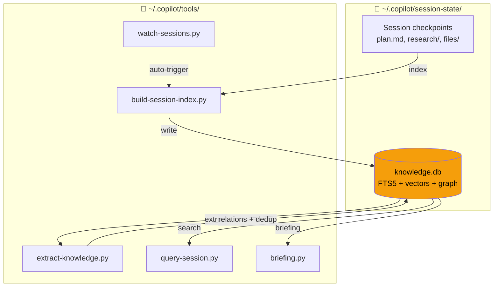

# Copilot Session Knowledge Tools

> **Problem:** Each Copilot CLI / Claude Code session accumulates valuable experience (bugs encountered, patterns used, decisions made) — but new sessions start from zero, repeating past mistakes.
>
> **Solution:** This tool indexes all session data into SQLite, auto-extracts knowledge, and enables search + briefing before every task.

## Demo

```bash
# macOS/Linux: python3 | Windows: python or py
$ python3 query-session.py "docker networking"

Found 5 result(s) for: docker networking
  1. [tool] Docker compose network config — Use bridge network with...
  2. [mistake] DNS resolution failed in container — Fixed by adding...
  3. [pattern] Docker/WSL architecture — On Windows, Docker Engine...

Knowledge entries matching: docker networking (3 results)
  #1970 [tool] brain/docker/DockerfileBrainApp (conf: 0.8)
  #2045 [mistake] Port conflicts in docker compose (conf: 0.7)
  #1977 [pattern] Docker/WSL bridge networking (conf: 0.6)

Use --detail <id> for full content
```

```
$ python3 briefing.py "fix docker compose"

📋 Briefing: fix docker compose
⚠️ Past Mistakes to Avoid
  #2045 Port conflicts — check docker ps before starting
🔧 Relevant Tools & Configs
  #1970 DockerfileBrainApp — JVM flag fix for containers
📚 Related Past Work
  [checkpoint] Docker networking and WSL setup (session de828552)
```

## Setup

### Prerequisites

- Python 3.10+ (no pip packages needed)
- Copilot CLI (`~/.copilot/session-state/` directory must exist) and/or Claude Code

> **Note:** Use `python3` on macOS/Linux, `python` or `py` on Windows.
> All commands in this README use `python3` — substitute `python` on Windows.

### Install

**Recommended (auto-update enabled):**
```bash
# Clone as ~/.copilot/tools/ — auto-update keeps it current
git clone https://github.com/magicpro97/copilot-session-knowledge.git ~/.copilot/tools

# First run — index sessions + extract knowledge + run migrations
python3 ~/.copilot/tools/build-session-index.py    # indexes + auto-embeds
python3 ~/.copilot/tools/extract-knowledge.py
python3 ~/.copilot/tools/migrate.py
python3 ~/.copilot/tools/install.py --test

# macOS: install LaunchAgents (auto-start watcher + daily auto-update)
bash ~/.copilot/tools/launchd/install-launchd.sh
```

**Alternative (manual copy):**
```bash
git clone https://github.com/magicpro97/copilot-session-knowledge.git
cd copilot-session-knowledge
mkdir -p ~/.copilot/tools && cp *.py *.sh ~/.copilot/tools/
```

**Windows (PowerShell):**
```powershell
git clone https://github.com/magicpro97/copilot-session-knowledge.git
cd copilot-session-knowledge
New-Item -ItemType Directory -Force "$env:USERPROFILE\.copilot\tools"
Copy-Item *.py,*.sh "$env:USERPROFILE\.copilot\tools\"

python "$env:USERPROFILE\.copilot\tools\build-session-index.py"
python "$env:USERPROFILE\.copilot\tools\extract-knowledge.py"
python "$env:USERPROFILE\.copilot\tools\migrate.py"
```

**Tip:** Add aliases for convenience (bash/zsh):
```bash
alias qs='python3 ~/.copilot/tools/query-session.py'
alias brief='python3 ~/.copilot/tools/briefing.py'
alias learn='python3 ~/.copilot/tools/learn.py'
# Usage: qs "docker error" | brief "fix login" | learn --pattern "Title" "Desc"
```

## Usage

### Briefing (recommended before every major task)

```bash
brief "implement user CRUD"          # Compact ~500 tokens
brief "implement user CRUD" --full   # Full detail ~3K tokens
brief --auto                         # Auto-detect from git state
brief --wakeup                       # Ultra-compact (~170 tokens) for session start
brief --titles-only                  # Index only (~10 tok/entry) — progressive disclosure
brief --titles-only "DynamoDB"       # Filtered titles
brief --wing backend --room patient  # Filter by wing/room (palace-style)
brief "task" --for-subagent --budget 3000  # Capped output for sub-agent injection
brief "task" --min-confidence 0.7    # High-quality entries only
brief "task" --for-subagent          # Compact context block for sub-agent prompts
```

### Search

```bash
qs "search terms"                    # Compact results
qs "search terms" --verbose          # Full content
qs "docker" --type research          # Filter by doc type
qs "spring" --source copilot         # Filter by agent source
qs --mistakes                        # View past errors
qs --patterns                        # View best practices
qs --decisions                       # View architecture decisions
```

### Drill Down (use entry ID from search results)

```bash
qs --detail 2045                     # View full entry details
qs --context 2045                    # Entry + entries from same session
qs --related 2045                    # Entry + knowledge graph connections
qs --graph "spring boot"             # Mini knowledge graph by topic
```

### Semantic Search (requires embedding API key)

```bash
qs "deployment error" --semantic     # Search by meaning, not just keywords
python3 ~/.copilot/tools/embed.py --setup   # Setup API key (Windows: python)
```

### Record Knowledge (learn.py)

```bash
# 7 observation types
learn --mistake "Title"   "What went wrong and fix"         --tags "docker,compose"
learn --pattern "Title"   "What works well / best practice" --tags "lambda"
learn --decision "Title"  "Architecture decision rationale" --tags "cdk"
learn --tool "Title"      "Useful tool/config details"      --tags "vscode"
learn --feature "Title"   "New feature implementation"      --tags "api"
learn --refactor "Title"  "Code improvement description"    --tags "cleanup"
learn --discovery "Title" "Codebase finding or insight"     --tags "dynamodb"

# Structured facts (discrete, verifiable statements)
learn --pattern "DynamoDB Batch Ops" "How to use batch writes" \
  --fact "batch write limit is 25 items" \
  --fact "GSI eventually consistent"

# Palace categorization
learn --mistake "Auth bug" "Description" --wing backend --room auth

# Knowledge graph relations
learn --relate "copyToGroup" "reads_from" "patient-dynamic-form.json"
learn --relate "addPatient Lambda" "writes_to" "dataTable"

# Bulk import
learn --from-file notes.md  # Format: ## category: Title

# View
learn --list               # Recent entries
learn --stats              # Knowledge base statistics
```

### Palace Concepts (Wing/Room)

Organize knowledge hierarchically:

| Wing | Description | Example Rooms |
|------|-------------|---------------|
| `backend` | Lambda, DynamoDB, SQS, API | patient, websocket, auth, dynamodb |
| `frontend` | Expo, React Native, screens | navigation, components, hooks |
| `testing` | Jest, Playwright, E2E | e2e, unit-test |
| `infrastructure` | CDK, VPC, CloudWatch | cdk, vpc, cloudwatch |
| `devops` | Git, CI/CD, Docker | git, pipeline, proxy |
| `shared` | TypeScript, ESLint, i18n | typescript, openapi |

Wings and rooms are **auto-detected** from tags/title. Override with `--wing`/`--room`.

### Auto-Update

```bash
python3 ~/.copilot/tools/auto-update-tools.py           # Auto-update (24h cooldown)
python3 ~/.copilot/tools/auto-update-tools.py --force    # Force update now
python3 ~/.copilot/tools/auto-update-tools.py --check    # Check only (no apply)
python3 ~/.copilot/tools/auto-update-tools.py --status   # Show version info
python3 ~/.copilot/tools/auto-update-tools.py --doctor   # Health check + manifest verify
python3 ~/.copilot/tools/auto-update-tools.py --skip-pull # Run pipeline only (used by post-merge hook)
```

**Smart pipeline:** After `git pull`, auto-update analyzes `git diff` to run only what changed:
- Python scripts changed → restart services
- LaunchAgent templates changed → reinstall LaunchAgents
- SKILL.md templates changed → redeploy to projects
- Embedding logic changed → rebuild embeddings (background)
- `auto-update-tools.py` itself changed → self-exec with new code before continuing

**Post-merge hook:** Automatically installed in `.git/hooks/post-merge` — triggers the pipeline
on manual `git pull` too. No need to remember to restart services.

**macOS:** Auto-update runs daily at 9 AM via LaunchAgent (installed by `install-launchd.sh`).

**Manual shell auto-start** (if not using LaunchAgents):
```bash
# Add to ~/.zshrc or ~/.bashrc
(python3 ~/.copilot/tools/auto-update-tools.py &) 2>/dev/null
```

## Architecture



### How it works

1. **Index** — `build-session-index.py` scans all session `.md` files → SQLite FTS5
2. **Extract** — `extract-knowledge.py` classifies into 7 types (mistake/pattern/decision/tool/feature/refactor/discovery), dedup by content hash
3. **Graph** — Auto-detect relations: same session, same tag, mistake→fix, same topic
4. **Palace** — Wing/room auto-categorization from tags/title for hierarchical browsing
5. **Search** — FTS5 keyword + optional semantic vector (Reciprocal Rank Fusion)
6. **Watch** — `watch-sessions.py` polls for changes, auto re-indexes
7. **Update** — `auto-update-tools.py` smart pipeline: git pull → diff-based targeted update → manifest verify

## Maintenance

```bash
python3 ~/.copilot/tools/build-session-index.py --incremental   # Update changed files + auto-embed
python3 ~/.copilot/tools/build-session-index.py --no-embed      # Index only, skip embeddings
python3 ~/.copilot/tools/extract-knowledge.py --stats           # View knowledge statistics
python3 ~/.copilot/tools/extract-knowledge.py --relations       # View relation statistics
python3 ~/.copilot/tools/watch-sessions.py --daemon             # Run in background, auto-index
python3 ~/.copilot/tools/embed.py --status                      # Embedding coverage stats
python3 ~/.copilot/tools/embed.py --build                       # Rebuild all embeddings
python3 ~/.copilot/tools/install.py --deploy-skill              # Deploy SKILL.md
python3 ~/.copilot/tools/install.py --deploy-hooks              # Deploy hooks to ~/.copilot/hooks/
python3 ~/.copilot/tools/install.py --deploy-instructions       # Deploy global instructions
python3 ~/.copilot/tools/install.py --lock-hooks                # Lock hooks (tamper protection)
python3 ~/.copilot/tools/install.py --unlock-hooks              # Unlock hooks for updates
python3 ~/.copilot/tools/install.py --inject-global             # Inject into global copilot-instructions
# Windows: thay python3 → python
```

### Auto-start (no manual restart after reboot)

**macOS** — LaunchAgents (recommended):
```bash
bash ~/.copilot/tools/launchd/install-launchd.sh           # Install both agents
bash ~/.copilot/tools/launchd/install-launchd.sh --remove   # Uninstall

# Installs two LaunchAgents:
#   com.copilot.watch-sessions  — daemon, auto-indexes sessions + auto-embeds
#   com.copilot.auto-update     — daily 9 AM, git pulls tool updates + migrates DB

# Restart after code changes (auto-handled by post-merge hook):
# Manual git pull → post-merge hook triggers pipeline → services restarted automatically
```

**Windows** — Task Scheduler:
```powershell
$action = New-ScheduledTaskAction `
    -Execute "python" `
    -Argument "$env:USERPROFILE\.copilot\tools\watch-sessions.py --daemon" `
    -WorkingDirectory "$env:USERPROFILE\.copilot"

$trigger = New-ScheduledTaskTrigger -AtLogOn
$settings = New-ScheduledTaskSettingsSet -AllowStartIfOnBatteries -DontStopIfGoingOnBatteries `
    -RestartCount 3 -RestartInterval (New-TimeSpan -Minutes 1)

Register-ScheduledTask -TaskName "CopilotWatchSessions" `
    -Action $action -Trigger $trigger -Settings $settings `
    -Description "Auto-index Copilot session knowledge"
```

**Linux** — systemd user service:
```bash
mkdir -p ~/.config/systemd/user
cat > ~/.config/systemd/user/copilot-watch.service << 'EOF'
[Unit]
Description=Copilot Session Knowledge Watcher

[Service]
ExecStart=/usr/bin/python3 %h/.copilot/tools/watch-sessions.py --daemon
WorkingDirectory=%h/.copilot
Restart=on-failure
RestartSec=30

[Install]
WantedBy=default.target
EOF

systemctl --user enable --now copilot-watch.service
```

## Skills & Templates

This toolkit includes meta-skills and templates for project setup.

### Skills vs Agents — Important Distinction

This repo contains both **Skills** (SKILL.md) and **Agent templates** (.agent.md). They follow different specs:

| | Skills (SKILL.md) | Agents (.agent.md) |
|---|---|---|
| **Standard** | [Anthropic Agent Skills](https://github.com/anthropics/skills) | GitHub Copilot / Claude Code |
| **Purpose** | Instructions for specific tasks | Specialized sub-agent persona |
| **Frontmatter** | `name`, `description`, `license`, `allowed-tools`, `metadata`, `compatibility` | `name`, `description`, `tools`, `model` |
| **Triggered by** | AI matching description to user intent | Explicit delegation or keyword match |
| **Validation** | `quick_validate.py` from anthropics/skills | `hooks/lint-skills.py` (14 rules, auto-parses CLI schemas) |

**Key rule:** Skills use `allowed-tools` (optional string). Agents use `tools` (YAML list). Don't mix them.

### Available Skills

| Skill | Purpose |
|-------|---------|
| `session-knowledge-creator` | Generate session-knowledge SKILL.md for new projects |
| `agent-creator` | Generate `.agent.md` files from 8 reference templates |
| `tentacle-creator` | Create tentacles for multi-agent orchestration |
| `tentacle-orchestration` | Map tentacles to phased workflows |
| `hook-creator` | Generate quality enforcement hooks (preToolUse/postToolUse) |
| `workflow-creator` | Create phased development workflows with quality gates |

### Hook Templates (`skills/hook-creator/references/`)

Pre-built Copilot CLI hook scripts — customize and install per project:

| Hook | Type | Description |
|------|------|-------------|
| `dangerous-blocker.sh` | preToolUse | Blocks sudo, rm -rf /, force push, DB drops |
| `secret-detector.sh` | preToolUse | Blocks hardcoded API keys, tokens, private keys |
| `enforce-coding-standards.sh` | preToolUse | Blocks coding standard violations (2-tier: regex + optional linter). Language-agnostic — configure for TS/Python/Go/etc. |
| `enforce-tdd-pipeline.sh` | preToolUse | Blocks task_complete without valid TDD evidence. Git-aware, tamper-resistant, configurable phases |
| `architecture-guard.sh` | preToolUse | Enforces layer boundaries (clean arch, KMP, etc.) |
| `commit-gate.sh` | preToolUse | Blocks commit until verification requirements met |
| `test-reminder.sh` | postToolUse | Reminds to write tests when creating source files |
| `build-reminder.sh` | postToolUse | Reminds to verify build after N source file edits |
| `docs-reminder.sh/.py` | postToolUse | Warns after 3+ code edits without doc updates (cross-platform) |
| `session-banner.sh` | postToolUse | Shows session start checklist |

### Skill & Agent Linter (`hooks/lint-skills.py`)

Validates `.agent.md` and `SKILL.md` files against the Copilot CLI schema. Auto-parses the installed CLI's `app.js` for up-to-date field/tool definitions — falls back to hardcoded schemas if not found.

```bash
# Scan a single file
python3 ~/.copilot/tools/hooks/lint-skills.py path/to/file.agent.md

# Scan all files in a directory
python3 ~/.copilot/tools/hooks/lint-skills.py --all

# Scan a specific project
python3 ~/.copilot/tools/hooks/lint-skills.py --all --dir /path/to/project
```

**Rules (14 total):**

| Code | Severity | Checks |
|------|----------|--------|
| AG-001 | error | Missing required `description` field |
| AG-002 | warning | Deprecated `infer` → use `user-invocable` |
| AG-003 | warning | `description` exceeds 1024 chars |
| AG-004 | warning | `name` exceeds 64 chars |
| AG-005 | warning | Missing frontmatter (`---`) |
| AG-006 | warning | Unknown field (silently ignored by CLI) |
| AG-007 | error | VS Code tool name (not valid in CLI) |
| AG-008 | error | Claude Code tool name (not valid in CLI) |
| AG-009 | warning | Unknown tool name |
| AG-010 | error | `allowed-tools` used in agent (skill field) |
| SK-001 | error | Missing required `description` |
| SK-005 | warning | Missing frontmatter |
| SK-007 | warning | Unknown field (silently dropped) |
| SK-008 | error | `tools` used in skill (agent field) |

**Git pre-commit hook** — automatically installed at `.git/hooks/pre-commit`:
```bash
# Install manually
cp hooks/pre-commit .git/hooks/pre-commit && chmod +x .git/hooks/pre-commit
```

### Enforcement Hooks (`hooks/`)

Cross-platform Python hooks that enforce knowledge-base usage across sessions.
All hooks are standalone Python scripts (no bash/jq/perl dependencies).

| Hook | Type | Description |
|------|------|-------------|
| `auto-briefing.py` | sessionStart | Auto-runs briefing.py, creates marker |
| `verify-integrity.py` | sessionStart | Verifies hook files via SHA256 manifest |
| `session-end.py` | sessionEnd | Cleans up marker files |
| `enforce-briefing.py` | preToolUse | Blocks edit/create/bash-writes until briefing done |
| `enforce-learn.py` | preToolUse | Blocks git commit AND task_complete without learn.py |
| `track-bash-edits.py` | postToolUse | Detects file changes via `git status` (language-agnostic) |
| `learn-reminder.py` | postToolUse | Reminds to record learnings after task_complete |
| `test-after-edit.py` | postToolUse | Reminds to run tests after 3+ Python file edits |
| `tentacle-suggest.py` | postToolUse | Suggests tentacle when ≥3 files across ≥2 modules |
| `error-search-kb.py` | errorOccurred | Auto-searches knowledge base on errors |
| `pre-commit` | git pre-commit | Validates `.agent.md` / `SKILL.md` via `lint-skills.py` |

**Bash bypass protection:** Hooks detect file writes via bash commands (heredocs, redirects,
`sed -i`, `tee`, `cp`, `mv`, `curl -o`, etc.) AND verify actual changes via `git status`.

**Tamper protection:** Hook files are locked with OS immutable flags (`--lock-hooks`).

```bash
# Deploy hooks to user-level
python3 ~/.copilot/tools/install.py --deploy-hooks

# Lock hooks (AI agent cannot modify)
python3 ~/.copilot/tools/install.py --lock-hooks

# Unlock for updates
python3 ~/.copilot/tools/install.py --unlock-hooks
```

### Project Setup

```bash
# Full setup: installs all skills + patches AGENTS.md/CLAUDE.md
python3 ~/.copilot/tools/setup-project.py

# Skills only (no doc patching)
python3 ~/.copilot/tools/setup-project.py --skill-only

# Dry run
python3 ~/.copilot/tools/setup-project.py --dry-run
```

## AI Agent Integration

To have agents automatically use the knowledge base, deploy the skill into your project:

```bash
python3 ~/.copilot/tools/install.py --deploy-skill
# → Creates .github/skills/session-knowledge/SKILL.md (Copilot CLI)
# → Creates .claude/skills/session-knowledge.md (Claude Code)
```

After deployment, agents will automatically run `briefing.py` before tasks and search when needed.

### Enforce AI Usage (mandatory, not optional)

Skills are suggestions — AI agents can still skip them. To **enforce** usage, inject into global instructions:

```bash
python3 ~/.copilot/tools/install.py --inject-global
```

This automatically:
1. Adds a `🧠 Session Knowledge — MANDATORY` section to `~/.github/copilot-instructions.md`
2. Uses HTML markers (`<!-- SESSION-KNOWLEDGE-START/END -->`) for idempotent updates
3. Places it at the highest position so the AI reads it first

Re-run when content needs updating — markers ensure replacement, not duplication.

**Full setup (one time):**
```bash
cd your-project
python3 ~/.copilot/tools/install.py --deploy-skill    # Skill for the project
python3 ~/.copilot/tools/install.py --inject-global   # Enforce via global instructions
```

### Sub-agent Context Injection

Sub-agents (explore, task, general-purpose) don't access the knowledge base directly.
The main agent injects context into their prompts:

```bash
python3 ~/.copilot/tools/briefing.py "task description" --for-subagent
```

Output is a compact `[KNOWLEDGE CONTEXT]` block (~200 tokens) to embed in sub-agent prompts:
```
[KNOWLEDGE CONTEXT — from past sessions]
  [AVOID] Port conflicts — check docker ps before starting
  [USE] Docker bridge network for service-to-service communication
  [CONFIG] DockerfileBrainApp — JVM flag fix for containers
[END KNOWLEDGE CONTEXT]
```

## Security

- **No pickle** — all serialization uses JSON (backward-compat: detect pickle magic bytes, warn, fallback)
- **Parameterized SQL** — zero SQL injection vectors
- **FTS5 sanitization** — strips operators (`OR`, `AND`, `NOT`, `NEAR`, `*`, `"`)
- **Atomic lock** — `O_CREAT | O_EXCL` eliminates TOCTOU race conditions
- **API key protection** — config files chmod `0o600`, env vars preferred over files
- **Path validation** — WSL path traversal protection
- **Input limits** — title 200 chars, content 10K chars, FTS query 500 chars
- **Injection scanning** — `learn.py` scans all entries against 15 regex patterns (prompt injection, SSH backdoors, credential exfiltration). Matching entries are REJECTED. Bypass with `--skip-gate`
- **Hook tamper protection** — OS immutable flags (`chflags uchg` / `chattr +i` / `attrib +R`) prevent AI agents from modifying enforcement hooks. SHA256 manifest verified at session start
- **Bash bypass detection** — `track-bash-edits.py` uses `git status` to detect ALL file modifications regardless of method (heredoc, redirect, cp, mv, tee, etc.)

## Testing

```bash
python3 test_security.py    # 9 security tests (injection, pickle, locks, paths)
python3 test_fixes.py       # 65 tests (noise filter, sub-agent, launchd, DB health)
```

## Requirements

- **Python 3.10+** — pure stdlib, zero pip packages
- **SQLite FTS5** — included in Python
- **Cross-platform** — Windows, macOS, Linux
- **Optional:** `scikit-learn` (TF-IDF fallback), embedding API key (semantic search)
