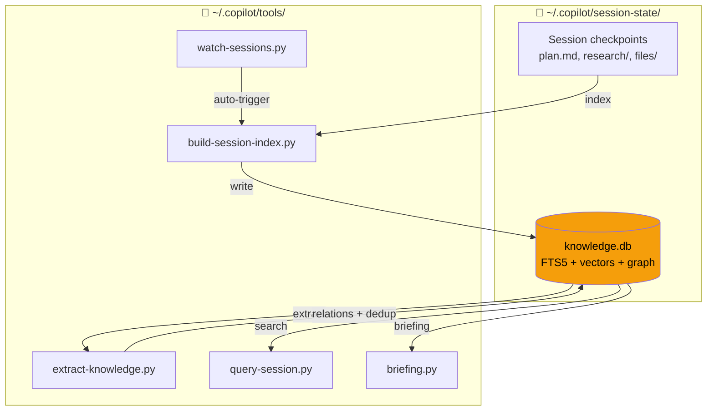

# Copilot Session Knowledge Tools

> **Vấn đề:** Mỗi session Copilot CLI / Claude Code tích lũy kinh nghiệm quý (lỗi đã gặp, pattern đã dùng, quyết định đã chọn) — nhưng session mới bắt đầu từ zero, lặp lại sai lầm cũ.
>
> **Giải pháp:** Tool này index tất cả session data vào SQLite, tự trích xuất knowledge, và cho phép search + briefing trước mỗi task.

## Demo

```
$ python query-session.py "docker networking"

Found 5 result(s) for: docker networking
  1. [tool] Docker compose network config — Use bridge network with...
  2. [mistake] DNS resolution failed in container — Fixed by adding...
  3. [pattern] Docker/WSL architecture — On Windows, Docker Engine...

Knowledge entries matching: docker networking (3 results)
  #1970 [tool] brain/docker/DockerfileBrainApp (conf: 0.8)
  #2045 [mistake] Port conflicts in docker compose (conf: 0.7)
  #1977 [pattern] Docker/WSL bridge networking (conf: 0.6)

Use --detail <id> for full content
```

```
$ python briefing.py "fix docker compose"

📋 Briefing: fix docker compose
⚠️ Past Mistakes to Avoid
  #2045 Port conflicts — check docker ps before starting
🔧 Relevant Tools & Configs
  #1970 DockerfileBrainApp — JVM flag fix for containers
📚 Related Past Work
  [checkpoint] Docker networking and WSL setup (session de828552)
```

## Setup

### Prerequisites

- Python 3.10+ (no pip packages needed)
- Copilot CLI (`~/.copilot/session-state/` directory must exist) and/or Claude Code

### Install

**macOS / Linux:**
```bash
git clone https://github.com/magicpro97/copilot-session-knowledge.git
cd copilot-session-knowledge
mkdir -p ~/.copilot/tools && cp *.py ~/.copilot/tools/

# First run
python ~/.copilot/tools/build-session-index.py
python ~/.copilot/tools/extract-knowledge.py
python ~/.copilot/tools/install.py --test
```

**Windows (PowerShell):**
```powershell
git clone https://github.com/magicpro97/copilot-session-knowledge.git
cd copilot-session-knowledge
New-Item -ItemType Directory -Force "$env:USERPROFILE\.copilot\tools"
Copy-Item *.py "$env:USERPROFILE\.copilot\tools\"

python "$env:USERPROFILE\.copilot\tools\build-session-index.py"
python "$env:USERPROFILE\.copilot\tools\extract-knowledge.py"
python "$env:USERPROFILE\.copilot\tools\install.py" --test
```

**Tip:** Thêm alias cho tiện (bash):
```bash
alias qs='python ~/.copilot/tools/query-session.py'
alias brief='python ~/.copilot/tools/briefing.py'
# Dùng: qs "docker error" | brief "fix login"
```

## Usage

### Briefing (khuyến khích chạy trước mỗi task lớn)

```bash
brief "implement user CRUD"          # Compact ~500 tokens
brief "implement user CRUD" --full   # Full detail ~3K tokens
brief --auto                         # Auto-detect từ git state
```

### Search

```bash
qs "search terms"                    # Compact results
qs "search terms" --verbose          # Full content
qs "docker" --type research          # Filter theo doc type
qs "spring" --source copilot         # Filter theo agent source
qs --mistakes                        # Xem lỗi đã gặp
qs --patterns                        # Xem best practices
qs --decisions                       # Xem quyết định kiến trúc
```

### Drill Down (dùng entry ID từ kết quả search)

```bash
qs --detail 2045                     # Xem chi tiết 1 entry
qs --context 2045                    # Entry + các entry cùng session
qs --related 2045                    # Entry + knowledge graph connections
qs --graph "spring boot"             # Mini knowledge graph theo topic
```

### Semantic Search (cần embedding API key)

```bash
qs "deployment error" --semantic     # Search theo nghĩa, không chỉ keyword
python ~/.copilot/tools/embed.py --setup   # Setup API key
```

## Architecture



### How it works

1. **Index** — `build-session-index.py` scans all session `.md` files → SQLite FTS5
2. **Extract** — `extract-knowledge.py` phân loại thành mistakes/patterns/decisions/tools, dedup bằng content hash
3. **Graph** — Tự detect relations: cùng session, cùng tag, mistake→fix, cùng topic
4. **Search** — FTS5 keyword + optional semantic vector (Reciprocal Rank Fusion)
5. **Watch** — `watch-sessions.py` poll thay đổi, tự re-index (lock file chống chạy trùng)

## Maintenance

```bash
python ~/.copilot/tools/build-session-index.py --incremental   # Update only changed files
python ~/.copilot/tools/extract-knowledge.py --stats           # Xem thống kê knowledge
python ~/.copilot/tools/extract-knowledge.py --relations       # Xem thống kê relations
python ~/.copilot/tools/watch-sessions.py --daemon             # Chạy nền, tự index
python ~/.copilot/tools/install.py --deploy-skill              # Deploy SKILL.md vào project
```

## AI Agent Integration

Để agent tự động dùng knowledge base, deploy skill vào project:

```bash
python ~/.copilot/tools/install.py --deploy-skill
# → Tạo .github/skills/session-knowledge/SKILL.md (Copilot CLI)
# → Tạo .claude/skills/session-knowledge.md (Claude Code)
```

Sau đó agent sẽ tự chạy `briefing.py` trước mỗi task và search khi cần.

## Requirements

- **Python 3.10+** — pure stdlib, zero pip packages
- **SQLite FTS5** — included in Python
- **Cross-platform** — Windows, macOS, Linux
- **Optional:** `scikit-learn` (TF-IDF fallback), embedding API key (semantic search)
