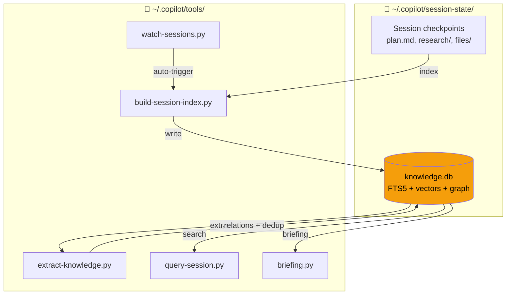

# Copilot Session Knowledge Tools

> **Vấn đề:** Mỗi session Copilot CLI / Claude Code tích lũy kinh nghiệm quý (lỗi đã gặp, pattern đã dùng, quyết định đã chọn) — nhưng session mới bắt đầu từ zero, lặp lại sai lầm cũ.
>
> **Giải pháp:** Tool này index tất cả session data vào SQLite, tự trích xuất knowledge, và cho phép search + briefing trước mỗi task.

## Demo

```bash
# macOS/Linux: python3 | Windows: python hoặc py
$ python3 query-session.py "docker networking"

Found 5 result(s) for: docker networking
  1. [tool] Docker compose network config — Use bridge network with...
  2. [mistake] DNS resolution failed in container — Fixed by adding...
  3. [pattern] Docker/WSL architecture — On Windows, Docker Engine...

Knowledge entries matching: docker networking (3 results)
  #1970 [tool] brain/docker/DockerfileBrainApp (conf: 0.8)
  #2045 [mistake] Port conflicts in docker compose (conf: 0.7)
  #1977 [pattern] Docker/WSL bridge networking (conf: 0.6)

Use --detail <id> for full content
```

```
$ python3 briefing.py "fix docker compose"

📋 Briefing: fix docker compose
⚠️ Past Mistakes to Avoid
  #2045 Port conflicts — check docker ps before starting
🔧 Relevant Tools & Configs
  #1970 DockerfileBrainApp — JVM flag fix for containers
📚 Related Past Work
  [checkpoint] Docker networking and WSL setup (session de828552)
```

## Setup

### Prerequisites

- Python 3.10+ (no pip packages needed)
- Copilot CLI (`~/.copilot/session-state/` directory must exist) and/or Claude Code

> **Note:** Dùng `python3` trên macOS/Linux, `python` hoặc `py` trên Windows.
> Tất cả commands trong README dùng `python3` — thay bằng `python` nếu trên Windows.

### Install

**Recommended (auto-update enabled):**
```bash
# Clone as ~/.copilot/tools/ — auto-update keeps it current
git clone https://github.com/magicpro97/copilot-session-knowledge.git ~/.copilot/tools

# First run — index sessions + extract knowledge + run migrations
python3 ~/.copilot/tools/build-session-index.py
python3 ~/.copilot/tools/extract-knowledge.py
python3 ~/.copilot/tools/migrate.py
python3 ~/.copilot/tools/install.py --test
```

**Alternative (manual copy):**
```bash
git clone https://github.com/magicpro97/copilot-session-knowledge.git
cd copilot-session-knowledge
mkdir -p ~/.copilot/tools && cp *.py *.sh ~/.copilot/tools/
```

**Windows (PowerShell):**
```powershell
git clone https://github.com/magicpro97/copilot-session-knowledge.git
cd copilot-session-knowledge
New-Item -ItemType Directory -Force "$env:USERPROFILE\.copilot\tools"
Copy-Item *.py,*.sh "$env:USERPROFILE\.copilot\tools\"

python "$env:USERPROFILE\.copilot\tools\build-session-index.py"
python "$env:USERPROFILE\.copilot\tools\extract-knowledge.py"
python "$env:USERPROFILE\.copilot\tools\migrate.py"
```

**Tip:** Thêm alias cho tiện (bash/zsh):
```bash
alias qs='python3 ~/.copilot/tools/query-session.py'
alias brief='python3 ~/.copilot/tools/briefing.py'
alias learn='python3 ~/.copilot/tools/learn.py'
# Dùng: qs "docker error" | brief "fix login" | learn --pattern "Title" "Desc"
```

## Usage

### Briefing (khuyến khích chạy trước mỗi task lớn)

```bash
brief "implement user CRUD"          # Compact ~500 tokens
brief "implement user CRUD" --full   # Full detail ~3K tokens
brief --auto                         # Auto-detect từ git state
brief --wakeup                       # Ultra-compact (~170 tokens) cho session start
brief --titles-only                  # Index only (~10 tok/entry) — progressive disclosure
brief --titles-only "DynamoDB"       # Filtered titles
brief --wing backend --room patient  # Filter by wing/room (palace-style)
brief "task" --min-confidence 0.7    # Chỉ high-quality entries
brief "task" --for-subagent          # Compact context block cho sub-agent prompts
```

### Search

```bash
qs "search terms"                    # Compact results
qs "search terms" --verbose          # Full content
qs "docker" --type research          # Filter theo doc type
qs "spring" --source copilot         # Filter theo agent source
qs --mistakes                        # Xem lỗi đã gặp
qs --patterns                        # Xem best practices
qs --decisions                       # Xem quyết định kiến trúc
```

### Drill Down (dùng entry ID từ kết quả search)

```bash
qs --detail 2045                     # Xem chi tiết 1 entry
qs --context 2045                    # Entry + các entry cùng session
qs --related 2045                    # Entry + knowledge graph connections
qs --graph "spring boot"             # Mini knowledge graph theo topic
```

### Semantic Search (cần embedding API key)

```bash
qs "deployment error" --semantic     # Search theo nghĩa, không chỉ keyword
python3 ~/.copilot/tools/embed.py --setup   # Setup API key (Windows: python)
```

### Record Knowledge (learn.py)

```bash
# 7 observation types
learn --mistake "Title"   "What went wrong and fix"         --tags "docker,compose"
learn --pattern "Title"   "What works well / best practice" --tags "lambda"
learn --decision "Title"  "Architecture decision rationale" --tags "cdk"
learn --tool "Title"      "Useful tool/config details"      --tags "vscode"
learn --feature "Title"   "New feature implementation"      --tags "api"
learn --refactor "Title"  "Code improvement description"    --tags "cleanup"
learn --discovery "Title" "Codebase finding or insight"     --tags "dynamodb"

# Structured facts (discrete, verifiable statements)
learn --pattern "DynamoDB Batch Ops" "How to use batch writes" \
  --fact "batch write limit is 25 items" \
  --fact "GSI eventually consistent"

# Palace categorization
learn --mistake "Auth bug" "Description" --wing backend --room auth

# Knowledge graph relations
learn --relate "copyToGroup" "reads_from" "patient-dynamic-form.json"
learn --relate "addPatient Lambda" "writes_to" "dataTable"

# Bulk import
learn --from-file notes.md  # Format: ## category: Title

# View
learn --list               # Recent entries
learn --stats              # Knowledge base statistics
```

### Palace Concepts (Wing/Room)

Organize knowledge hierarchically:

| Wing | Description | Example Rooms |
|------|-------------|---------------|
| `backend` | Lambda, DynamoDB, SQS, API | patient, websocket, auth, dynamodb |
| `frontend` | Expo, React Native, screens | navigation, components, hooks |
| `testing` | Jest, Playwright, E2E | e2e, unit-test |
| `infrastructure` | CDK, VPC, CloudWatch | cdk, vpc, cloudwatch |
| `devops` | Git, CI/CD, Docker | git, pipeline, proxy |
| `shared` | TypeScript, ESLint, i18n | typescript, openapi |

Wings and rooms are **auto-detected** from tags/title. Override with `--wing`/`--room`.

### Auto-Update

```bash
python3 ~/.copilot/tools/auto-update-tools.py           # Auto-update (24h cooldown)
python3 ~/.copilot/tools/auto-update-tools.py --force    # Force update now
python3 ~/.copilot/tools/auto-update-tools.py --status   # Show version info
python3 ~/.copilot/tools/auto-update-tools.py --doctor   # Health check
```

Add to `~/.zshrc` or `~/.bashrc` for auto-start:
```bash
# Auto-update session-knowledge tools (background, 24h cooldown)
(python3 ~/.copilot/tools/auto-update-tools.py &) 2>/dev/null
```

## Architecture



### How it works

1. **Index** — `build-session-index.py` scans all session `.md` files → SQLite FTS5
2. **Extract** — `extract-knowledge.py` classifies into 7 types (mistake/pattern/decision/tool/feature/refactor/discovery), dedup by content hash
3. **Graph** — Auto-detect relations: same session, same tag, mistake→fix, same topic
4. **Palace** — Wing/room auto-categorization from tags/title for hierarchical browsing
5. **Search** — FTS5 keyword + optional semantic vector (Reciprocal Rank Fusion)
6. **Watch** — `watch-sessions.py` polls for changes, auto re-indexes
7. **Update** — `auto-update-tools.py` cross-platform git-based auto-update with DB migration

## Maintenance

```bash
python3 ~/.copilot/tools/build-session-index.py --incremental   # Update only changed files
python3 ~/.copilot/tools/extract-knowledge.py --stats           # Xem thống kê knowledge
python3 ~/.copilot/tools/extract-knowledge.py --relations       # Xem thống kê relations
python3 ~/.copilot/tools/watch-sessions.py --daemon             # Chạy nền, tự index
python3 ~/.copilot/tools/install.py --deploy-skill              # Deploy SKILL.md
python3 ~/.copilot/tools/install.py --inject-global             # Inject vào global copilot-instructions
# Windows: thay python3 → python
```

### Auto-start Watcher (khỏi chạy thủ công sau reboot)

**macOS** — LaunchAgent:
```bash
cp templates/com.copilot.watch-sessions.plist ~/Library/LaunchAgents/
# ⚠️ Sửa YOUR_USERNAME và đường dẫn python3 trong plist trước khi load
sed -i '' "s|YOUR_USERNAME|$(whoami)|g" ~/Library/LaunchAgents/com.copilot.watch-sessions.plist
launchctl load ~/Library/LaunchAgents/com.copilot.watch-sessions.plist
```

**Windows** — Task Scheduler:
```powershell
$action = New-ScheduledTaskAction `
    -Execute "python" `
    -Argument "$env:USERPROFILE\.copilot\tools\watch-sessions.py --daemon" `
    -WorkingDirectory "$env:USERPROFILE\.copilot"

$trigger = New-ScheduledTaskTrigger -AtLogOn
$settings = New-ScheduledTaskSettingsSet -AllowStartIfOnBatteries -DontStopIfGoingOnBatteries `
    -RestartCount 3 -RestartInterval (New-TimeSpan -Minutes 1)

Register-ScheduledTask -TaskName "CopilotWatchSessions" `
    -Action $action -Trigger $trigger -Settings $settings `
    -Description "Auto-index Copilot session knowledge"
```

**Linux** — systemd user service:
```bash
mkdir -p ~/.config/systemd/user
cat > ~/.config/systemd/user/copilot-watch.service << 'EOF'
[Unit]
Description=Copilot Session Knowledge Watcher

[Service]
ExecStart=/usr/bin/python3 %h/.copilot/tools/watch-sessions.py --daemon
WorkingDirectory=%h/.copilot
Restart=on-failure
RestartSec=30

[Install]
WantedBy=default.target
EOF

systemctl --user enable --now copilot-watch.service
```

## AI Agent Integration

Để agent tự động dùng knowledge base, deploy skill vào project:

```bash
python3 ~/.copilot/tools/install.py --deploy-skill
# → Tạo .github/skills/session-knowledge/SKILL.md (Copilot CLI)
# → Tạo .claude/skills/session-knowledge.md (Claude Code)
```

Sau đó agent sẽ tự chạy `briefing.py` trước mỗi task và search khi cần.

### Enforce AI Usage (bắt buộc dùng, không bỏ qua)

Skill chỉ là gợi ý — AI agent vẫn có thể bỏ qua. Để **bắt buộc**, inject vào global instructions:

```bash
python3 ~/.copilot/tools/install.py --inject-global
```

Lệnh này tự động:
1. Thêm section `🧠 Session Knowledge — BẮT BUỘC` vào `~/.github/copilot-instructions.md`
2. Dùng HTML markers (`<!-- SESSION-KNOWLEDGE-START/END -->`) để update idempotent
3. Đặt ở vị trí cao nhất (ngay sau "BẮT BUỘC" checklist) để AI đọc đầu tiên

Chạy lại khi cần update nội dung — markers đảm bảo chỉ thay thế, không duplicate.

**Full setup (1 lần):**
```bash
cd your-project
python3 ~/.copilot/tools/install.py --deploy-skill    # Skill cho project
python3 ~/.copilot/tools/install.py --inject-global   # Enforce qua global instructions
```

### Sub-agent Context Injection

Sub-agents (explore, task, general-purpose) không truy cập knowledge base trực tiếp.
Main agent inject context vào prompt của chúng:

```bash
python3 ~/.copilot/tools/briefing.py "task description" --for-subagent
```

Output là block `[KNOWLEDGE CONTEXT]` compact (~200 tokens) để embed vào sub-agent prompt:
```
[KNOWLEDGE CONTEXT — from past sessions]
  [AVOID] Port conflicts — check docker ps before starting
  [USE] Docker bridge network for service-to-service communication
  [CONFIG] DockerfileBrainApp — JVM flag fix for containers
[END KNOWLEDGE CONTEXT]
```

## Security

- **No pickle** — tất cả serialization dùng JSON (backward-compat: detect pickle magic bytes, warn, fallback)
- **Parameterized SQL** — zero SQL injection vectors
- **FTS5 sanitization** — strips operators (`OR`, `AND`, `NOT`, `NEAR`, `*`, `"`)
- **Atomic lock** — `O_CREAT | O_EXCL` eliminates TOCTOU race conditions
- **API key protection** — config files chmod `0o600`, env vars ưu tiên hơn file
- **Path validation** — WSL path traversal protection
- **Input limits** — title 200 chars, content 10K chars, FTS query 500 chars

## Testing

```bash
python3 test_security.py    # 9 security tests (injection, pickle, locks, paths)
python3 test_fixes.py       # 65 tests (noise filter, sub-agent, launchd, DB health)
```

## Requirements

- **Python 3.10+** — pure stdlib, zero pip packages
- **SQLite FTS5** — included in Python
- **Cross-platform** — Windows, macOS, Linux
- **Optional:** `scikit-learn` (TF-IDF fallback), embedding API key (semantic search)
