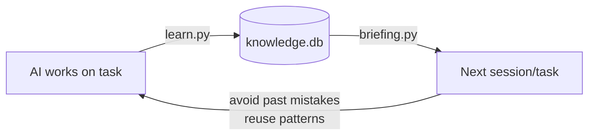
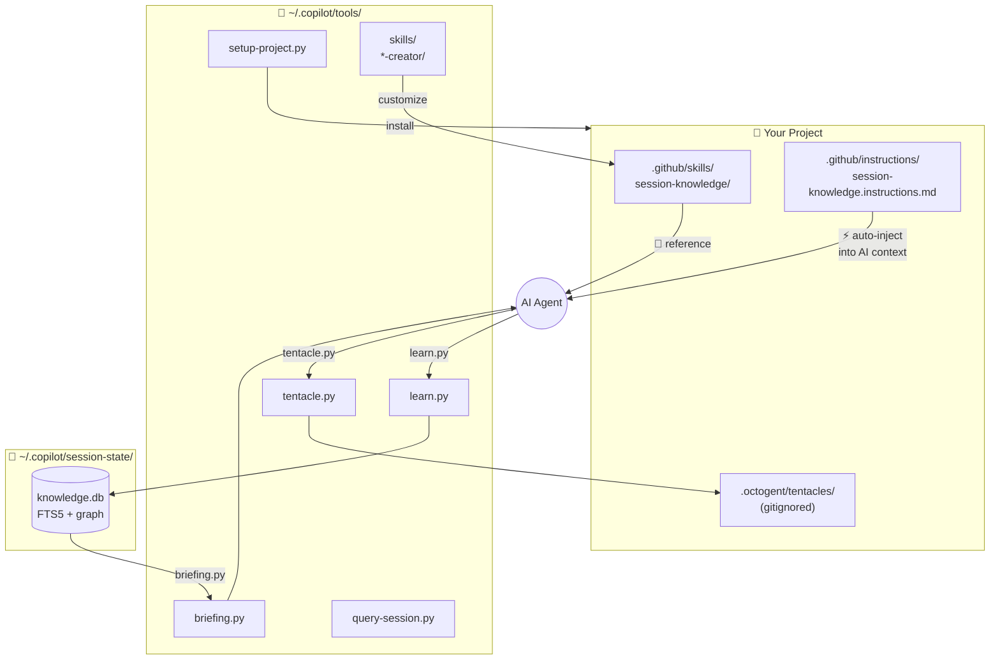

# Copilot Session Knowledge & Orchestration Tools

> **Problem:** Each Copilot CLI / Claude Code session accumulates valuable experience (bugs fixed, patterns learned, architectural decisions) — but new sessions start from zero, repeating past mistakes.
>
> **Solution:** This toolkit indexes all session data into SQLite, auto-extracts knowledge, enables search + briefing before each task, and provides multi-agent orchestration via the tentacle pattern.

## Quick Start

```bash
# 1. Clone tools (one-time)
git clone https://github.com/magicpro97/copilot-session-knowledge.git ~/.copilot/tools

# 2. Index your sessions (first run)
python3 ~/.copilot/tools/build-session-index.py
python3 ~/.copilot/tools/extract-knowledge.py
python3 ~/.copilot/tools/migrate.py

# 3. Setup a project (run from project root)
cd your-project
python3 ~/.copilot/tools/setup-project.py

# 4. Customize for your project (optional — run inside AI session)
#    /session-knowledge-creator   → AI analyzes project → generates customized knowledge skill
#    /tentacle-creator            → AI analyzes project → generates customized tentacle skill
```

### What `setup-project.py` installs

```
.github/
├── skills/
│   ├── session-knowledge/SKILL.md           — Knowledge workflow reference
│   ├── session-knowledge-creator/SKILL.md   — Meta-skill: customize for project
│   ├── tentacle-creator/SKILL.md            — Meta-skill: customize tentacle
│   └── tentacle-orchestration/SKILL.md      — Multi-agent orchestration reference
├── instructions/
│   └── session-knowledge.instructions.md    — ⚡ Auto-injected enforcement
CLAUDE.md                                    — Patched with briefing section
.gitignore                                   — .octogent/ entry added
```

**Key insight:** `.instructions.md` files with `applyTo: "**/*"` are **auto-injected into EVERY AI context** — this is real enforcement. Without it, AI agents treat skills as optional and often skip them.

## Core Components

### 1. Session Knowledge (learn → index → brief)



**Record knowledge after each task:**
```bash
learn --mistake "Title"   "What went wrong and fix"         --tags "docker,compose"
learn --pattern "Title"   "What works well / best practice" --tags "lambda"
learn --decision "Title"  "Architecture decision rationale" --tags "cdk"
learn --discovery "Title" "Codebase finding"                --tags "dynamodb" \
  --fact "Discrete verifiable fact 1" --fact "Fact 2"
```

**Brief before next task:**
```bash
brief --wakeup                       # Ultra-compact (~170 tokens) session start
brief --auto --compact               # Auto-detect from git state (~500 tokens)
brief "implement user CRUD"          # Topic-specific briefing
brief "task" --for-subagent          # Compact block for sub-agent prompts
```

**Search knowledge:**
```bash
qs "docker networking"               # Keyword search
qs --mistakes                        # All past mistakes
qs --patterns                        # All best practices
qs --detail 2045                     # Full entry details
```

### 2. Tentacle Orchestration (multi-agent pattern)

Based on the [OctoGent](https://github.com/hesamsheikh/octogent) architecture. Each "tentacle" is a scoped work context with its own CONTEXT.md, todo list, notes, and handoff file.

```bash
# Create scoped work contexts
python3 ~/.copilot/tools/tentacle.py create api-export \
  --scope "backend/lambda/internal-api/v1/export*" \
  --goal "Implement patient data export API" \
  --briefing   # ← auto-inject past knowledge from briefing.py

# Add tasks
python3 ~/.copilot/tools/tentacle.py todo api-export add "Implement GET handler"
python3 ~/.copilot/tools/tentacle.py todo api-export add "Add SQS consumer"

# Generate agent dispatch prompts
python3 ~/.copilot/tools/tentacle.py swarm api-export
# → Outputs ready-to-copy task() call with full context

# Record results and learn
python3 ~/.copilot/tools/tentacle.py complete api-export
# → Marks done + auto-records to knowledge base via learn.py
```

**Status dashboard:**
```bash
python3 ~/.copilot/tools/tentacle.py status
# ┌─────────────────────────────────────────────────────┐
# │ 🐙 Tentacles Dashboard                              │
# ├───────────────┬────────┬───────┬────────────────────┤
# │ Name          │ Status │ Todos │ Scope              │
# ├───────────────┼────────┼───────┼────────────────────┤
# │ api-export    │ ✅ done │ 3/3   │ backend/lambda/... │
# │ fe-export     │ 🔄 wip │ 1/2   │ frontend/src/...   │
# └───────────────┴────────┴───────┴────────────────────┘
```

### 3. Creator Skills (meta-skills)

Generic skills work everywhere but lack project-specific context. **Creator skills** analyze your project and generate customized skills:

| Creator Skill | What it does |
|---|---|
| `session-knowledge-creator` | Analyzes project → generates SKILL.md + .instructions.md + CLAUDE.md patch |
| `tentacle-creator` | Analyzes project → generates SKILL.md with project-specific agent mappings |

**Usage (inside AI session):**
```
/session-knowledge-creator   ← AI reads project, generates 3 customized files
/tentacle-creator            ← AI reads project, generates customized tentacle skill
```

The creator analyzes: language, framework, folder structure, existing agents, test patterns, and generates skills that reference YOUR project's conventions.

## Setup Options

```bash
# Full setup (recommended)
python3 ~/.copilot/tools/setup-project.py

# Skills only, no config patching
python3 ~/.copilot/tools/setup-project.py --skill-only

# Skip tentacle orchestration
python3 ~/.copilot/tools/setup-project.py --no-tentacle

# Preview changes
python3 ~/.copilot/tools/setup-project.py --dry-run

# Explicit project root
python3 ~/.copilot/tools/setup-project.py /path/to/project
```

**Idempotent** — run multiple times safely. Only updates files when content changes.

## Architecture



### Three-Layer Enforcement

Why AI agents actually USE these tools (instead of ignoring them):

| Layer | File | Mechanism |
|---|---|---|
| **1. Auto-inject** | `.github/instructions/*.instructions.md` | Copilot CLI auto-loads into EVERY context |
| **2. Config** | `CLAUDE.md` / `copilot-instructions.md` | Agent reads at session start |
| **3. Reference** | `.github/skills/*/SKILL.md` | Detailed docs, invoked on demand |

Layer 1 is the **enforcement** — short imperative rules auto-injected into context. Without it, AI treats everything as optional.

## Detailed Usage

### briefing.py

```bash
brief "implement user CRUD"          # Topic-specific (~500 tokens)
brief "implement user CRUD" --full   # Full detail (~3K tokens)
brief --auto                         # Auto-detect from git state
brief --wakeup                       # Ultra-compact (~170 tokens) session start
brief --titles-only                  # Index only (~10 tok/entry)
brief --titles-only "DynamoDB"       # Filtered titles
brief --wing backend --room patient  # Filter by palace wing/room
brief "task" --min-confidence 0.7    # High-quality entries only
brief "task" --for-subagent          # Compact block for sub-agent prompts
```

### learn.py

```bash
# 7 observation types
learn --mistake "Title"   "What went wrong and fix"         --tags "tag1,tag2"
learn --pattern "Title"   "What works well"                 --tags "tag1"
learn --decision "Title"  "Architecture decision"           --tags "tag1"
learn --tool "Title"      "Useful tool/config"              --tags "tag1"
learn --feature "Title"   "New feature built"               --tags "tag1"
learn --refactor "Title"  "Code improvement"                --tags "tag1"
learn --discovery "Title" "Codebase insight"                --tags "tag1" \
  --fact "Discrete verifiable fact 1" --fact "Fact 2"

# Relations (knowledge graph)
learn --relate "copyToGroup" "reads_from" "patient-form.json"

# View
learn --list              # Recent entries
learn --stats             # Knowledge base statistics
```

### query-session.py

```bash
qs "search terms"                    # Compact results
qs "search terms" --verbose          # Full content
qs "docker" --type research          # Filter by doc type
qs --mistakes                        # Past mistakes
qs --patterns                        # Best practices
qs --decisions                       # Architecture decisions
qs --detail 2045                     # Full entry details
qs --context 2045                    # Entry + same-session entries
qs --related 2045                    # Entry + knowledge graph connections
qs --graph "spring boot"             # Mini knowledge graph
qs "deployment error" --semantic     # Semantic search (needs API key)
```

### tentacle.py

```bash
# Lifecycle
tentacle create <name> --scope "paths" --goal "description" [--briefing]
tentacle list
tentacle status
tentacle delete <name>

# Tasks
tentacle todo <name> add "task description"
tentacle todo <name> done <index>
tentacle todo <name> list

# Orchestration
tentacle swarm <name>          # Generate dispatch prompts from pending todos
tentacle handoff <name> "msg"  # Record agent output [--learn]
tentacle complete <name>       # Mark done + auto-learn
```

## Maintenance

```bash
python3 ~/.copilot/tools/build-session-index.py --incremental   # Index changed files
python3 ~/.copilot/tools/extract-knowledge.py --stats           # Knowledge stats
python3 ~/.copilot/tools/watch-sessions.py --daemon             # Auto-index on change
python3 ~/.copilot/tools/auto-update-tools.py                   # Auto-update (24h cooldown)
python3 ~/.copilot/tools/auto-update-tools.py --doctor          # Health check
```

### Aliases (optional)

```bash
alias qs='python3 ~/.copilot/tools/query-session.py'
alias brief='python3 ~/.copilot/tools/briefing.py'
alias learn='python3 ~/.copilot/tools/learn.py'
alias tentacle='python3 ~/.copilot/tools/tentacle.py'
```

## Security

- **No pickle** — all serialization uses JSON
- **Parameterized SQL** — zero injection vectors
- **FTS5 sanitization** — strips operators (`OR`, `AND`, `NOT`, `NEAR`)
- **Atomic lock** — `O_CREAT | O_EXCL` eliminates TOCTOU
- **API key protection** — config files chmod `0o600`
- **Input limits** — title 200 chars, content 10K chars, FTS query 500 chars

## Requirements

- **Python 3.10+** — pure stdlib, zero pip packages
- **SQLite FTS5** — included in Python
- **Cross-platform** — Windows, macOS, Linux
- **Optional:** embedding API key (semantic search)
