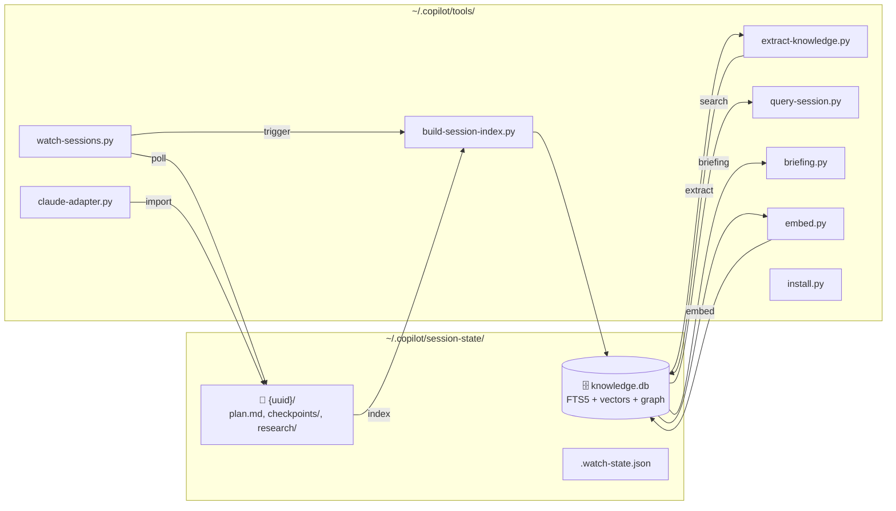
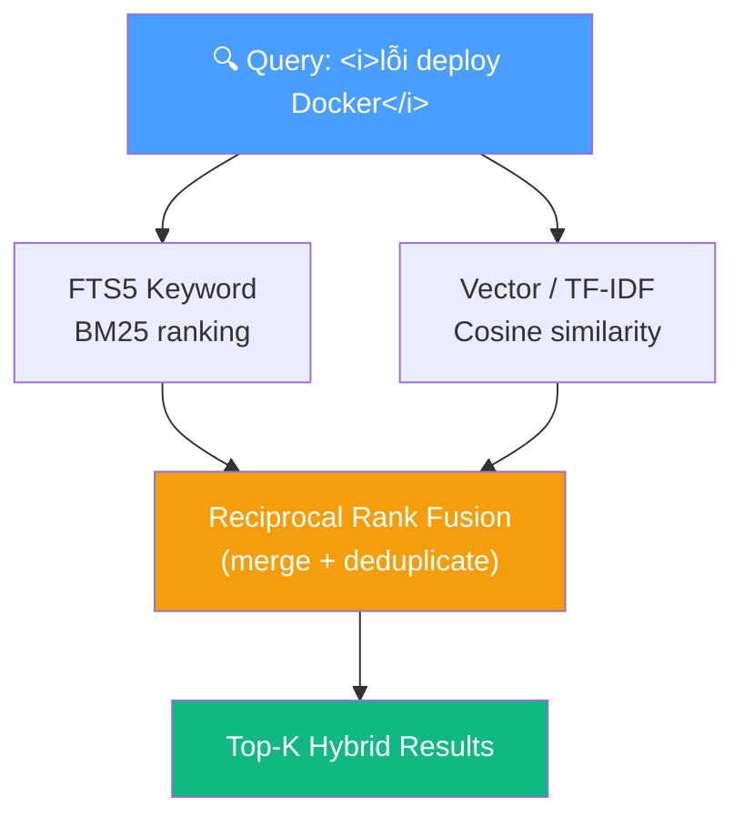
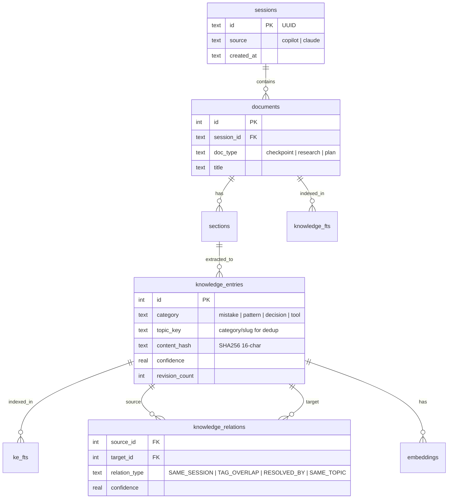

# Copilot Session Knowledge Tools

Instant search across all Copilot CLI and Claude Code session data.  
Turns raw checkpoints into a queryable SQLite knowledge base with **hybrid search** (FTS5 + semantic vector), **knowledge graph**, and **auto-deduplication**.

**Key features:**
- 🔍 Hybrid search — keyword (FTS5 BM25) + semantic vector (multi-provider API)
- 🧠 Knowledge extraction — patterns, mistakes, decisions, tools from session history
- 🕸️ Knowledge graph — auto-detected relations between entries (4 relation types)
- 📋 Agent briefing — inject past experience into AI context (~500 tokens)
- ⚡ Progressive disclosure — compact by default, drill down with `--detail`/`--context`
- 🔄 Hash-based dedup — re-extraction skips already-seen content

## Architecture



## Setup

```bash
python ~/.copilot/tools/install.py                 # Auto-detect agents + show status
python ~/.copilot/tools/install.py --test          # Run self-test (DB, FTS, imports)
python ~/.copilot/tools/install.py --deploy-skill  # Deploy SKILL.md to current project
python ~/.copilot/tools/install.py --uninstall     # Remove tools (keeps session data)
```

### Embedding Setup (optional, enables semantic search)

```bash
python ~/.copilot/tools/embed.py --setup    # Interactive provider config
python ~/.copilot/tools/embed.py --build    # Generate embeddings
python ~/.copilot/tools/embed.py --test     # Test provider connectivity
python ~/.copilot/tools/embed.py --status   # Show embedding stats
```

**Supported providers** (all OpenAI-compatible):
| Provider | Model | Cost | Env Variable |
|---|---|---|---|
| Fireworks AI | nomic-embed-text-v1.5 | $0.008/1M tokens | `FIREWORKS_API_KEY` |
| OpenAI | text-embedding-3-small | $0.02/1M tokens | `OPENAI_API_KEY` |
| OpenRouter | (routes to providers) | varies | `OPENROUTER_API_KEY` |
| Custom | any | any | `EMBEDDING_API_KEY` |

**Fallback**: TF-IDF (requires `pip install scikit-learn`). Works without any API key.

## Usage

### Keyword Search (default, compact output)

```bash
python ~/.copilot/tools/query-session.py "search terms"              # Compact results (~50 tokens/entry)
python ~/.copilot/tools/query-session.py "search terms" --verbose    # Full content per entry
python ~/.copilot/tools/query-session.py "docker" --type research
python ~/.copilot/tools/query-session.py "docker" --source claude    # Filter by source (copilot/claude/all)
python ~/.copilot/tools/query-session.py --list
python ~/.copilot/tools/query-session.py --list --source copilot     # List only Copilot sessions
python ~/.copilot/tools/query-session.py --session de828552
python ~/.copilot/tools/query-session.py --recent                    # Show recent activity
```

### Semantic / Hybrid Search

```bash
python ~/.copilot/tools/query-session.py "lỗi triển khai" --semantic
python ~/.copilot/tools/query-session.py "how to fix Docker" --semantic -v
python ~/.copilot/tools/embed.py --search "deployment error"
```

### Knowledge Categories

```bash
python ~/.copilot/tools/query-session.py --mistakes    # Past errors + fixes (compact)
python ~/.copilot/tools/query-session.py --patterns    # Best practices (compact)
python ~/.copilot/tools/query-session.py --decisions   # Architecture choices (compact)
python ~/.copilot/tools/query-session.py --tools       # Tool configs (compact)
python ~/.copilot/tools/query-session.py --mistakes --verbose  # Full content
```

### Progressive Disclosure (drill-down)

```bash
python ~/.copilot/tools/query-session.py --detail <id>    # Full detail of a single entry
python ~/.copilot/tools/query-session.py --context <id>   # Entry + related entries (same session/category)
```

### Knowledge Graph

```bash
python ~/.copilot/tools/query-session.py --related <id>      # Show graph connections for an entry
python ~/.copilot/tools/query-session.py --graph "spring boot"  # Mini knowledge graph for a topic
```

Relation types (auto-detected during extraction):
- **SAME_SESSION** — entries from the same session
- **TAG_OVERLAP** — entries sharing tags
- **RESOLVED_BY** — mistakes linked to patterns that fix them
- **SAME_TOPIC** — entries with the same topic key across sessions

### Briefing (context injection for AI agents)

```bash
python ~/.copilot/tools/briefing.py "implement user CRUD"          # Compact briefing (~500 tokens)
python ~/.copilot/tools/briefing.py "implement user CRUD" --full   # Full markdown briefing
python ~/.copilot/tools/briefing.py "fix Docker compose" --compact # XML compact for AI context
python ~/.copilot/tools/briefing.py "fix Docker compose" --json    # JSON output
python ~/.copilot/tools/briefing.py "spring boot" --limit 5        # More results per category
python ~/.copilot/tools/briefing.py --auto                         # Auto-detect from git/plan
python ~/.copilot/tools/briefing.py --auto --full                  # Full briefing with auto-detect
```

### Export

```bash
python ~/.copilot/tools/query-session.py "spring" --export json
python ~/.copilot/tools/query-session.py --mistakes --export markdown
```

### Maintenance

```bash
python ~/.copilot/tools/build-session-index.py                # Full rebuild
python ~/.copilot/tools/build-session-index.py --incremental  # Update only
python ~/.copilot/tools/build-session-index.py --embed        # Rebuild + embeddings
python ~/.copilot/tools/build-session-index.py --stats        # Show stats
python ~/.copilot/tools/extract-knowledge.py                  # Re-extract (with dedup)
python ~/.copilot/tools/extract-knowledge.py --stats          # Show extraction stats
python ~/.copilot/tools/extract-knowledge.py --list           # List all extracted entries
python ~/.copilot/tools/extract-knowledge.py --category mistakes  # Show specific category
python ~/.copilot/tools/watch-sessions.py                     # Auto-index daemon (lock-file protected)
python ~/.copilot/tools/watch-sessions.py --interval 30       # Custom poll interval (seconds)
python ~/.copilot/tools/watch-sessions.py --once              # Single check then exit
python ~/.copilot/tools/watch-sessions.py --daemon            # Run as background process
python ~/.copilot/tools/watch-sessions.py --install-hint      # Print auto-start setup instructions
```

## Search Modes



## Database Schema



## Requirements

**Core** (zero external dependencies):
- Python 3.10+
- SQLite with FTS5 (included in Python)
- Cross-platform: Windows, macOS, Linux

**Optional** (for enhanced features):
- `scikit-learn` — TF-IDF fallback (`pip install scikit-learn`)
- Any API key above — Vector embeddings for true semantic search

## AI Agent Integration

Skills that teach agents to use these tools:
- **Copilot CLI**: `.github/skills/session-knowledge/SKILL.md`
- **Claude Code**: `.claude/skills/session-knowledge.md`

Agents can search the knowledge base before starting tasks to leverage past experience.
