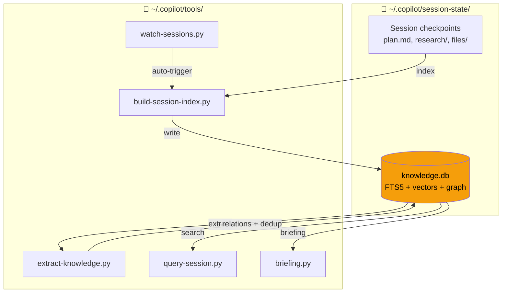

# Copilot Session Knowledge

> Cross-session memory for AI coding agents — never repeat past mistakes.

[](LICENSE)
[]()
[]()
[]()

## Table of Contents

- [Why?](#why)
- [Quick Start](#quick-start)
- [Installation](#installation)
- [Usage](#usage)
- [Architecture](#architecture)
- [Auto-Update](#auto-update)
- [Skills & Hooks](#skills--hooks)
- [Trend Scout](#trend-scout)
- [Security](#security)
- [Testing](#testing)
- [FAQ](#faq)
- [Contributing](#contributing)
- [License](#license)

## Why?

Each Copilot CLI / Claude Code session accumulates valuable experience — bugs encountered, patterns discovered, architecture decisions made. But every new session starts from zero, repeating past mistakes.

This tool **indexes all session data** into SQLite FTS5, **auto-extracts knowledge** into 7 categories (mistakes, patterns, decisions, tools, features, refactors, discoveries), and provides **search + briefing** so your AI agent never forgets what it learned.

## Quick Start

```bash
# 1. Clone
git clone https://github.com/magicpro97/copilot-session-knowledge.git ~/.copilot/tools

# 2. Build knowledge base
python3 ~/.copilot/tools/build-session-index.py && python3 ~/.copilot/tools/extract-knowledge.py

# 3. Get a briefing
python3 ~/.copilot/tools/briefing.py "your task description"
```

That's it. Your AI agent now has memory across sessions.

## Installation

### Prerequisites

- Python 3.10+ (no pip packages needed — pure stdlib)
- Copilot CLI (`~/.copilot/session-state/`) and/or Claude Code

> **Note:** Use `python3` on macOS/Linux, `python` or `py` on Windows.

### Recommended (auto-update enabled)

```bash
git clone https://github.com/magicpro97/copilot-session-knowledge.git ~/.copilot/tools
python3 ~/.copilot/tools/build-session-index.py
python3 ~/.copilot/tools/extract-knowledge.py
python3 ~/.copilot/tools/migrate.py
python3 ~/.copilot/tools/install.py --test

# macOS: install LaunchAgents (auto-start watcher + daily auto-update)
bash ~/.copilot/tools/launchd/install-launchd.sh
```

### Alternative (manual copy)

```bash
git clone https://github.com/magicpro97/copilot-session-knowledge.git
cd copilot-session-knowledge
mkdir -p ~/.copilot/tools && cp *.py *.sh ~/.copilot/tools/
```

### Windows (PowerShell)

```powershell
git clone https://github.com/magicpro97/copilot-session-knowledge.git
cd copilot-session-knowledge
New-Item -ItemType Directory -Force "$env:USERPROFILE\.copilot\tools"
Copy-Item *.py,*.sh "$env:USERPROFILE\.copilot\tools\"
python "$env:USERPROFILE\.copilot\tools\build-session-index.py"
python "$env:USERPROFILE\.copilot\tools\extract-knowledge.py"
python "$env:USERPROFILE\.copilot\tools\migrate.py"
```

### Aliases (optional)

```bash
alias qs='python3 ~/.copilot/tools/query-session.py'
alias brief='python3 ~/.copilot/tools/briefing.py'
alias learn='python3 ~/.copilot/tools/learn.py'
```

## Usage

### Briefing (before every task)

```bash
brief "implement user CRUD"          # Compact ~500 tokens
brief "implement user CRUD" --full   # Full detail ~3K tokens
brief --auto                         # Auto-detect from git state
brief "task" --for-subagent          # Compact context for sub-agents
brief --task "memory-surface"        # Task-scoped recall by task ID
brief "fix Docker" --json            # JSON output for programmatic use
brief "task" --budget 3000           # Cap output to 3000 chars (frozen snapshot)
brief "task" --compact               # XML compact block for AI context injection
```

### Search

```bash
qs "search terms"                    # Compact results
qs "docker" --type research          # Filter by doc type
qs --mistakes                        # View past errors
qs --detail 2045                     # Full entry by ID
qs "deployment error" --semantic     # Semantic search (requires API key)
qs --file src/auth.py                # Entries touching a specific file
qs --module auth                     # Entries for a module or directory
qs --task memory-surface             # Entries tagged with a task ID
qs --diff                            # Entries for current git diff files
qs "search" --export json            # Export results as JSON
qs "search" --budget 2000            # Cap output to 2000 chars
qs "search" --compact                # Titles-only with ~token hint
```

### Advanced Query Flags

Column-scoped BM25 search and session inspection (schema v8):

```bash
qs "bug" --in user                   # Search only in user_messages column
qs "deploy" --in assistant           # Search only in assistant_messages column
qs --from <session-id>               # Show all entries from a specific session
qs "error" --snippet                 # Include surrounding context snippet
qs --session-raw <session-id>        # Dump raw events for a session
```

### Index Health

```bash
python3 ~/.copilot/tools/index-status.py          # Row counts, FTS integrity, offset coverage
```

### Record Knowledge

```bash
learn --mistake "Title"  "What went wrong"     --tags "docker"
learn --pattern "Title"  "Best practice"       --tags "lambda"
learn --decision "Title" "Architecture choice" --tags "cdk"
learn --mistake "Title"  "Description" --task "memory-surface" --file "briefing.py"
learn --mistake "Title"  "Description" --json  # Machine-readable JSON output
```

### Tentacle Orchestration (runtime-bundle workflow)

Multi-agent parallel execution via scoped work units. The runtime-bundle workflow:

```bash
# 1. Create a tentacle with scope + briefing
python3 ~/.copilot/tools/tentacle.py create api-export \
  --scope "src/api/*.py" --desc "Export API endpoints" --briefing

# 2. Add atomic todo items (one per agent delegation unit)
python3 ~/.copilot/tools/tentacle.py todo api-export add "Generate OpenAPI schema"

# 3. Dispatch — choose output mode:
python3 ~/.copilot/tools/tentacle.py swarm api-export \
  --agent-type general-purpose --model claude-sonnet-4.6              # single prompt
python3 ~/.copilot/tools/tentacle.py swarm api-export --output parallel  # one dispatch per todo
python3 ~/.copilot/tools/tentacle.py swarm api-export --output json      # structured JSON

# 4. After agents finish: record results and close
python3 ~/.copilot/tools/tentacle.py handoff api-export "Done. Learned X" --learn
python3 ~/.copilot/tools/tentacle.py complete api-export
```

> `--output parallel` maximises parallelism (one agent per todo). `--output json` is for
> programmatic consumption. `--briefing` injects live session-knowledge at dispatch time
> (incompatible with `--output json`).

**Commit restriction:** Sub-agents must not run `git commit` or `git push`. When git hooks
are installed (`install.py --install-git-hooks`), both operations are **blocked at the git level**
while a `dispatched-subagent-active` marker is active and the marker's `git_root` matches the
current repo. Even without hooks, this is a hard convention: only the orchestrator commits,
after merging and verifying tentacle results. Enforcement is local-only — cloud-delegated runs
are not covered.

> **Cross-repo isolation:** Each marker entry carries a `git_root` field. If Terminal A has an
> active tentacle in repo A, a `git commit` in repo B is **not blocked** — the hook skips
> markers whose `git_root` doesn't match the committing repo. Markers written without `git_root`
> (old format or dispatch from a non-git directory) conservatively block as before.

> **Stuck marker:** If the orchestrator crashes before `tentacle.py complete`, the marker stays
> active for up to 4 hours (TTL dead-man switch). To clear it manually:
> ```bash
> python3 ~/.copilot/tools/tentacle.py complete <name>
> # or directly:
> rm ~/.copilot/markers/dispatched-subagent-active
> ```

### Tentacle Next Step

```bash
# Show the grounded next step for a named tentacle (read-only)
python3 ~/.copilot/tools/tentacle.py next-step api-export         # First pending todo + checkpoint context
python3 ~/.copilot/tools/tentacle.py next-step api-export --all   # All pending todos
python3 ~/.copilot/tools/tentacle.py next-step api-export --briefing        # + live knowledge briefing
python3 ~/.copilot/tools/tentacle.py next-step api-export --no-checkpoint   # Skip checkpoint context
python3 ~/.copilot/tools/tentacle.py next-step api-export --format json     # JSON output
```

### Project Context

```bash
# Generate deterministic project-context.md (repo structure, profile, hooks, test expectations)
python3 ~/.copilot/tools/project-context.py                # Write to session files/ dir
python3 ~/.copilot/tools/project-context.py --stdout       # Print to stdout only
python3 ~/.copilot/tools/project-context.py --output PATH  # Write to explicit path
python3 ~/.copilot/tools/project-context.py --profile python  # Force a preset profile
python3 ~/.copilot/tools/project-context.py --list-profiles   # Show available profiles
```

No AI generation, no network access. The artifact is derived purely from repo/profile facts and is deterministic for the same repo state.

### Checkpoint Lifecycle

```bash
# Save
python3 ~/.copilot/tools/checkpoint-save.py --title "Auth done" --overview "JWT added"
# Read back (read-only)
python3 ~/.copilot/tools/checkpoint-restore.py --list
python3 ~/.copilot/tools/checkpoint-restore.py --show latest
python3 ~/.copilot/tools/checkpoint-restore.py --export latest --format json
# Compare
python3 ~/.copilot/tools/checkpoint-diff.py --from 1 --to latest
python3 ~/.copilot/tools/checkpoint-diff.py --summary
python3 ~/.copilot/tools/checkpoint-diff.py --from 1 --to latest --pager   # external pager (safe allowlist)
```

### Web UI (browse.py)

A read-only local web UI for browsing the knowledge base from a browser. Bound to `127.0.0.1` only — not accessible from other machines.

```bash
python browse.py --port 8080 --token YOUR_TOKEN
# Then open http://127.0.0.1:8080/?token=YOUR_TOKEN in your browser
# Omit --port for a random free port (printed on startup)
```

Security: token is required on every request; `Content-Security-Policy` blocks inline scripts. Do not expose this port externally.

#### Primary UI (v2) — Next.js

The `/v2/*` routes are the primary browse experience and serve the modern Next.js 16 frontend (`browse-ui/`). Start at `http://127.0.0.1:8080/v2/sessions?token=YOUR_TOKEN`.

| Route | Description |
|-------|-------------|
| `/v2/sessions` | Session list |
| `/v2/sessions/[id]` | Session detail + timeline |
| `/v2/search` | Full-text + semantic search |
| `/v2/insights` | Knowledge insights |
| `/v2/graph` | Knowledge graph (force-directed) |
| `/v2/settings` | Preferences |

To rebuild the primary UI after editing `browse-ui/src/`:
```bash
cd browse-ui && pnpm build
```

#### Legacy UI (v1, deprecated but still supported)

The classic Python-rendered HTML routes remain available for backward compatibility while v2 is the default path.

| # | Route | Description |
|---|-------|-------------|
| F1 | `/` | Home — recent sessions list with quick-search bar |
| F2 | `/sessions` | Sessions — FTS5-powered session browser with pagination |
| F3 | `/session/<id>` | Session detail — knowledge entries, tool calls, file diffs |
| F4 | *(all pages)* | Command palette — `Ctrl+K` (ninja-keys) for keyboard navigation |
| F5 | `/graph` | Knowledge graph — interactive Cytoscape.js entity graph |
| F6 | `/diff` | Checkpoint diff — side-by-side diff between two checkpoints |
| F7 | `/search` | Search — FTS5 full-text search across knowledge + sessions |
| F9 | `/dashboard` | Dashboard — aggregate stats, session health, red-flag sessions, weekly mistakes trend, top error-prone modules |
| F10 | `/embeddings` | Embeddings — 2-D PCA scatterplot of knowledge-entry vectors |
| F11 | `/live` | Live feed — real-time SSE stream of new knowledge events |
| F13 | `/session/<id>/mindmap` | Mind map — D3.js radial mind-map of session knowledge |
| F15 | `/eval` | Eval/Feedback — thumbs-up/down rating for knowledge entries |
| — | `/compare?a=&b=` | Compare — side-by-side diff of two sessions |
| — | `/session/<id>.md` | Export — plain-text markdown dump of a session for copy/paste |

> F8 (dark mode) is baked into the base template via `prefers-color-scheme` + localStorage toggle and is not a separate route.

### Profile Lifecycle

Build, share, and deploy custom workflow profiles:

```bash
python3 ~/.copilot/tools/profile-builder.py --name myteam \
  --hooks dangerous-blocker.sh commit-gate.sh --phases CLARIFY BUILD TEST COMMIT
python3 ~/.copilot/tools/profile-export.py --profile myteam --output myteam.json
python3 ~/.copilot/tools/profile-import.py --file myteam.json
python3 ~/.copilot/tools/setup-project.py --profile myteam   # deploy
```

📖 **Full command reference:** [docs/USAGE.md](docs/USAGE.md)

## Architecture



### How it works

1. **Index** — `build-session-index.py` Phase 1 (session metadata) + Phase 2 (event content) via `providers/` (`SessionProvider` ABC, `CopilotProvider`, `ClaudeProvider`) → SQLite FTS5 (schema v8)
2. **Extract** — `extract-knowledge.py` classifies into 7 types, dedup by content hash
3. **Graph** — Auto-detect relations: same session, same tag, mistake→fix
4. **Search** — `sessions_fts` BM25 + column-scoped (`--in user/assistant/tool`) + optional semantic vector (RRF)
5. **Watch** — `watch-sessions.py` adaptive polling (5 s/30 s/300 s tiers), auto re-indexes
6. **Browse** — `browse.py` read-only local web UI (127.0.0.1, token auth, CSP)
7. **Health** — `index-status.py` reports row counts, FTS integrity, event-offset coverage
8. **Update** — `auto-update-tools.py` smart pipeline: git pull → diff-based update
9. **Host metadata** — `host_manifest.py` is the single source of truth for supported hosts (Copilot CLI + Claude Code only) and their file-system paths; imported by `install.py`, `setup-project.py`, `watch-sessions.py`, and `auto-update-tools.py`
10. **Tentacle workspace** — `.octogent/` stores local tentacle state and is gitignored in this repo

**Schema versions:** v1–v6 (legacy indexing) → v7 (two-phase indexing + `event_offsets`) → v8 (current: `sessions_fts` contentless FTS5 + BM25). Run `python3 migrate.py` to upgrade.

**`providers/` package:** `SessionProvider` ABC defines `iter_sessions()` and `iter_events_with_offset()`. `CopilotProvider` handles `.md` checkpoints; `ClaudeProvider` handles JSONL with real byte-offset seeks for Phase 2.

## Auto-Update

```bash
python3 ~/.copilot/tools/auto-update-tools.py           # Auto-update (24h cooldown)
python3 ~/.copilot/tools/auto-update-tools.py --force    # Force update now
python3 ~/.copilot/tools/auto-update-tools.py --doctor   # Health check
```

Smart pipeline analyzes `git diff` to run only what changed. Post-merge hook auto-triggers on `git pull`.

📖 **Details:** [docs/AUTO-UPDATE.md](docs/AUTO-UPDATE.md)

## Skills & Hooks

14 built-in skills (session-knowledge-creator, agent-creator, hook-creator, tentacle-creator, tentacle-orchestration, workflow-creator, find-skills, agent-instructions-auditor, forge-ecosystem, code-reviewer, task-step-generator, conductor-creator, project-onboarding, karpathy-guidelines) plus 10 hook templates for quality enforcement.

`setup-project.py` is the canonical deployment surface: it reads the skill list from `INSTALL_ITEMS` and deploys all 14 skills to `.github/skills/<skill-name>/SKILL.md` in the **target project** (project scope only). Vendored skills (`karpathy-guidelines`) are additionally deployed to `.claude/skills/` for Claude Code. To make skills available globally across all projects, copy them to `~/.copilot/skills/` manually — `install.py --deploy-skill` deploys to the current project only and does not support a global target; `setup-project.py` does not perform global installation either. **Auto-update for globally installed vendored skills:** once `~/.copilot/skills/karpathy-guidelines/SKILL.md` already exists (placed there manually), auto-update will keep it current whenever the source changes — this is update-only and applies to Copilot CLI global scope (`~/.copilot/skills/`) only; `~/.claude/skills/` does not receive global auto-updates. When auto-update runs inside WSL and can resolve the current Windows user's profile, it refreshes that Windows Copilot CLI global install too — but that Windows-side install must also have been copied there manually first, because the refresh remains update-only. When a skill is available globally, **do not redeploy it at project scope** — Copilot deduplicates by skill name but having the same name at both scopes adds catalog noise and increases load.

Unified hook runner architecture — 1 Python process per event with fail-open, HMAC-signed markers, audit logging, and tamper protection. Hook deployment is **Copilot CLI only**; Claude Code does not support the `hook_runner.py` format.

**Dispatched-subagent git guard (phase 3+):** `install.py --install-git-hooks` deploys
`pre-commit` and `pre-push` scripts into the current repo's `.git/hooks/`. When the
`dispatched-subagent-active` marker is fresh and its `git_root` matches the committing repo,
both scripts block the git operation. This is the **primary enforcement surface** for subagent
commit restrictions — it fires at the filesystem level regardless of which agent process calls
git. The `preToolUse` hook provides defense-in-depth but cannot be relied on inside delegated
subagent contexts. Enforcement is **local-only**; cloud-delegated runs are not covered.

The marker now stores `active_tentacles` as a list of objects (`{name, ts, git_root, tentacle_id}`)
instead of a flat string list. Each entry carries its own dispatch timestamp, the git repository
root where the dispatch originated, and a stable UUID (`tentacle_id`) generated at `create` time.
Primary deduplication key is `tentacle_id` (phase 5, when present) with `(name, git_root)` as the
fallback for legacy entries. Two instances with the same logical name — whether in different repos
or in the same repo — each produce separate entries because their `tentacle_id` values differ.
The hook compares `git_root` against the repo running git using canonical path resolution
(`Path.resolve()`) so symlinks and dotdot paths that resolve to the same physical directory are
treated as the same repo — a marker from a different repo does not block commits there (cross-repo
isolation). Markers written without `git_root` (old format or non-git CWD) conservatively block.

> **Upgrade migration:** Cross-repo isolation is not retroactive for in-flight old-format
> markers. If a tentacle is still active when you upgrade, its existing marker entry has no
> `git_root` and will continue to block all repos until it completes, is cleared, or the 4-hour
> TTL expires. To get isolation immediately: `tentacle.py complete <name>` (or
> `rm ~/.copilot/markers/dispatched-subagent-active`), then re-dispatch.

**Same-repo multi-session (phase 5):** `tentacle.py create` now generates a `tentacle_id` UUID per
instance and auto-resolves directory collisions — if `<name>` already exists, it creates
`<name>-<uuid[:8]>` instead of exiting. All subsequent commands must use the printed slug name.
When a collision rename occurs, the runtime bundle surfaces the actual invocation slug in two
places: `manifest.json` gains a `slug` field and `session-metadata.md` gains a `Slug:` header
line, so sub-agents can always determine the correct name to use in follow-up commands.
Runtime identity ensures `complete` clears only the matching entry, not a sibling with the same
logical name. **Working-tree caveat:** this isolation is at the marker/enforcement layer only.
Concurrent tentacles in the same repo that touch overlapping files still share one working tree
and git index — file-level conflicts must be managed through non-overlapping scope declarations.

**Limitations:** `preToolUse` non-inheritance inside `task()`-spawned subagents remains a
platform limitation — git hooks are the reliable surface. `auto-update-tools.py` does **not**
auto-reinstall git hooks in registered repos — when hook files change it prints three warnings
to stderr: `"Git hook scripts updated — installed per-repo hooks are NOT automatically
refreshed."`, `"ACTION REQUIRED to pick up the cross-repo isolation fix (and future hook
changes):"`, and `"Re-run in EVERY protected repo: python3 ~/.copilot/tools/install.py
--install-git-hooks"`. Re-run that command in every protected repo after relevant tool updates.

```bash
python3 ~/.copilot/tools/install.py --deploy-skill        # Deploy skill to project
python3 ~/.copilot/tools/install.py --deploy-hooks        # Deploy enforcement hooks (Copilot CLI)
python3 ~/.copilot/tools/install.py --lock-hooks          # Lock hooks (tamper protection)
python3 ~/.copilot/tools/install.py --install-git-hooks   # Install pre-commit/pre-push into current repo

# Project setup with a workflow profile
python3 ~/.copilot/tools/setup-project.py --profile python      # Python hook bundle + WORKFLOW.md
python3 ~/.copilot/tools/install-project-hooks.py --profile mobile  # Mobile hooks standalone

# Custom profile lifecycle
python3 ~/.copilot/tools/profile-builder.py --name myteam --hooks dangerous-blocker.sh --phases BUILD TEST COMMIT
python3 ~/.copilot/tools/profile-export.py --profile myteam --output myteam.json
python3 ~/.copilot/tools/profile-import.py --file myteam.json
```

**Session-start hooks** run through the unified `hook_runner.py` architecture (1 Python process per event, fail-open, HMAC-signed markers, audit logging) and automatically refresh the codebase map (`codebase-map.py`) at the start of each session — no manual step required.

**Session-end hooks** (`hooks/session-end.py`) are **reminder-only**: they never auto-save checkpoints.
Set `COPILOT_CHECKPOINT_REMIND=1` to log a reminder when a session ends without saved checkpoints.
To save a checkpoint yourself, run `python3 ~/.copilot/tools/checkpoint-save.py`.

### Context Load Management

Excessive context load in Copilot sessions comes primarily from **duplicate skills** and **overly broad instruction surfaces** — not from the unified hook runner (which is a single process per event and is efficient). To keep load manageable:

- **Minimal-context-first**: start with `briefing.py --compact` (~500 tokens) before escalating to `--full`. Instruction files with `applyTo: '**/*'` inject into every context — scope them narrowly (e.g., `**/*.ts`) when they apply only to specific file types.
- **Progressive escalation**: retrieve only what the current step needs. Full session history and semantic search are available but should be requested on demand, not injected by default.
- **Propagation discipline**: when a skill or instruction is promoted to global scope (`~/.copilot/skills/`, `~/.github/instructions/`), remove the project-local copy to prevent duplication. Audit by manually comparing `~/.copilot/skills/` against `.github/skills/` in each project and removing any skill that exists at both levels. (`hooks/lint-skills.py --all` validates schema — it does not detect cross-scope duplicates.)

📖 **Skills reference:** [docs/SKILLS.md](docs/SKILLS.md) · **Hooks reference:** [docs/HOOKS.md](docs/HOOKS.md)

## Trend Scout

`trend-scout.py` discovers relevant GitHub repositories daily via the **GitHub Search API** (not the unofficial trending page — there is no official GitHub Trending API) and opens structured issues in the target repo for review.

```bash
python3 ~/.copilot/tools/trend-scout.py                 # Full pipeline
python3 ~/.copilot/tools/trend-scout.py --dry-run       # Preview without creating issues
python3 ~/.copilot/tools/trend-scout.py --search-only   # Discovery + shortlist, no issues
python3 ~/.copilot/tools/trend-scout.py --limit 3       # Cap issues created this run
python3 ~/.copilot/tools/trend-scout.py --repo owner/repo  # Override target repo
python3 ~/.copilot/tools/trend-scout.py --config path.json # Custom config file
python3 ~/.copilot/tools/trend-scout.py --token TOKEN   # Explicit GitHub token (overrides GITHUB_TOKEN env)
python3 ~/.copilot/tools/trend-scout.py --force         # Bypass grace window; force a new run
```

Requires a `GITHUB_TOKEN` env var (or `--token TOKEN` flag) to avoid rate limits. The tool auto-creates the `trend-scout` label and deduplicates against both open and closed issues using hidden deterministic markers — each marker is a 16-character truncated SHA-256 hash of the lowercased `owner/name`.

**Optional GitHub Models analysis:** set `analysis.enabled=true` in `trend-scout-config.json` to replace the repetitive heuristic learning bullets with repo-specific LLM analysis. The models path calls `https://models.github.ai/inference/chat/completions`, expects a publisher-qualified model ID such as `openai/gpt-4o-mini`, and reads its credential from `analysis.token_env` (default `GITHUB_MODELS_TOKEN`). If the token is missing, the model ID is invalid, or the response cannot be parsed, Trend Scout falls back to the heuristic engine automatically.

**Veto gate:** set `veto.require_domain_signals=1` in `trend-scout-config.json` to skip candidates whose heuristic learning engine produces only the generic fallback bullet (no domain-specific signals matched). Default is `0` — all shortlisted candidates are written.

**Grace window:** set `run_control.grace_window_hours` in config to prevent runs that are too close together. The last-run timestamp is persisted locally in `.trend-scout-state.json` (adjacent to the script). Use `--force` to bypass the grace window. Default is `0` (disabled). In GitHub Actions, the `.trend-scout-state.json` file is cached between runs via `actions/cache` so the grace window persists across GitHub-hosted runner instances.

**Tune discovery:** edit `trend-scout-config.json` to adjust seed keywords, topic filters, scoring weights, `min_stars`, `enrichment.readme_max_chars`, the optional `analysis.*` settings (`model`, `temperature`, `max_learnings`, `token_env`), `veto.require_domain_signals`, and `run_control.grace_window_hours`.

**GitHub Actions workflow** — `.github/workflows/trend-scout.yml` runs daily at 07:00 UTC with permissions `contents: read`, `issues: write`, and `models: read`. It also maps `secrets.GITHUB_TOKEN` into `GITHUB_MODELS_TOKEN`, so enabling `analysis.enabled` in config works in Actions without a separate secret. Manual runs via `workflow_dispatch` support `dry_run`, `search_only`, `repo`, `limit`, and `force` inputs.

📖 **Details:** [docs/USAGE.md#trend-scout](docs/USAGE.md#trend-scout)

## Security

- **Parameterized SQL** — zero SQL injection vectors
- **FTS5 sanitization** — strips operators (`OR`, `AND`, `NOT`, `NEAR`, `*`, `"`)
- **No pickle** — JSON serialization only (legacy pickle detection + warning)
- **Atomic locks** — `O_CREAT | O_EXCL` eliminates TOCTOU race conditions
- **API key protection** — config files chmod `0o600`, env vars preferred
- **Input limits** — title 200 chars, content 10K chars, FTS query 500 chars
- **Injection scanning** — `learn.py` scans entries against 15 regex patterns
- **Hook tamper protection** — OS immutable flags + SHA256 manifest verification

📖 **Full security policy:** [SECURITY.md](SECURITY.md)

## Testing

```bash
python3 test_security.py      # security regression tests
python3 test_fixes.py         # functional and integration regression tests
python3 test_trend_scout.py   # trend scout unit tests
```

## FAQ

**Q: Does it work with Claude Code?**
A: Yes. `claude-adapter.py` parses Claude Code JSONL sessions into the common format.

**Q: Do I need an API key?**
A: No. API keys are optional — only needed for semantic search via embedding providers (OpenAI, Fireworks, OpenRouter). Without it, FTS5 keyword search and TF-IDF fallback work offline.

**Q: Where is the data stored?**
A: `~/.copilot/session-state/knowledge.db` — a single SQLite file with FTS5 indexes.

**Q: Does it work on Windows?**
A: Yes. All scripts include Windows encoding fixes. Use `python` instead of `python3`. See [Installation](#windows-powershell). POSIX-style home paths from Git Bash (`/c/Users/...`), WSL (`/mnt/c/...`), and Cygwin (`/cygdrive/c/...`) are automatically normalised to native Windows paths for marker lookups.

**Q: How do I update?**
A: `python3 ~/.copilot/tools/auto-update-tools.py --force` or just `git pull` (post-merge hook handles the rest).

**Q: Will hooks crash my AI agent?**
A: No. The unified hook runner uses fail-open architecture — if any rule crashes, it logs the error and allows the action to proceed.

## Troubleshooting

### Copilot CLI auto-heal

If `copilot update` fails with an error like:

```
ENOENT: no such file or directory, rename .../.copilot/pkg/universal/.replaced-1.0.35-<pid>-<ts>
```

or `EPERM` on a rename inside `pkg/universal/`, run the healer:

```bash
python ~/.copilot/tools/copilot-cli-healer.py --status   # Diagnose
python ~/.copilot/tools/copilot-cli-healer.py --heal     # Fix
python ~/.copilot/tools/copilot-cli-healer.py --update   # Heal + retry copilot update
```

**Root cause:** The upstream Copilot CLI Node updater calls `fs.rename(src, dst)` without checking that `src` exists, leaving stale `.replaced-*` dirs and `pkg/tmp/` partial downloads behind. The healer removes these safely.

To prevent recurrence, register a daily scheduled task:

```bash
python ~/.copilot/tools/copilot-cli-healer.py --install-schedule
# or:
python ~/.copilot/tools/install.py --install-healer
```

📖 **Details:** [docs/copilot-cli-healer.md](docs/copilot-cli-healer.md)

## Quality Gates

Motivated by a C1-class bug where a misindented top-level block caused a `SyntaxError` in `watch-sessions.py` that slipped past review. The following gates make this class of error impossible to commit again:

- **`scripts/check_syntax.py`** — stdlib-only CLI; walks the repo and runs `py_compile` on every `.py` file. Prints `file:line: error` for each failure, exits 1 on any error.
- **`run_all_tests.py`** — stdlib-only test runner; discovers and runs all `test_*.py` files, prints a pass/fail table, and exits non-zero on any failure.
- **`hooks/rules/syntax_gate.py`** — `preToolUse` hook; blocks `edit`/`create` on `*.py` files if the new content has a syntax error. Registered in the unified hook runner via `hooks/rules/__init__.py`.
- **`.github/workflows/ci.yml`** — GitHub Actions CI; runs syntax check then all tests on every push and pull request (ubuntu-latest, Python 3.11).
- **`requirements-dev.txt`** — optional dev-only deps (`ruff`, `pytest-cov`); core runtime and all quality gates work without installing it.

## Contributing

See [CONTRIBUTING.md](CONTRIBUTING.md) for guidelines on reporting bugs, suggesting features, and submitting pull requests.

## License

[MIT](LICENSE) © [magicpro97](https://github.com/magicpro97)
