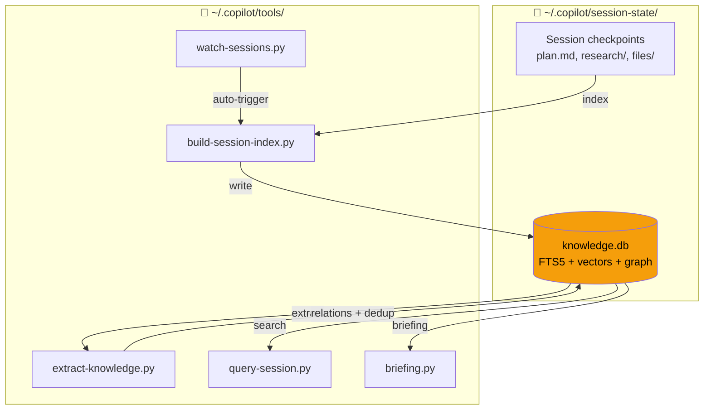

# Copilot Session Knowledge

> Cross-session memory for AI coding agents — never repeat past mistakes.

[](LICENSE)
[]()
[]()
[]()
[]()

## Table of Contents

- [Why?](#why)
- [Quick Start](#quick-start)
- [Installation](#installation)
- [Usage](#usage)
- [Architecture](#architecture)
- [Auto-Update](#auto-update)
- [Skills & Hooks](#skills--hooks)
- [Security](#security)
- [Testing](#testing)
- [FAQ](#faq)
- [Contributing](#contributing)
- [License](#license)

## Why?

Each Copilot CLI / Claude Code session accumulates valuable experience — bugs encountered, patterns discovered, architecture decisions made. But every new session starts from zero, repeating past mistakes.

This tool **indexes all session data** into SQLite FTS5, **auto-extracts knowledge** into 7 categories (mistakes, patterns, decisions, tools, features, refactors, discoveries), and provides **search + briefing** so your AI agent never forgets what it learned.

## Quick Start

```bash
# 1. Clone
git clone https://github.com/magicpro97/copilot-session-knowledge.git ~/.copilot/tools

# 2. Build knowledge base
python3 ~/.copilot/tools/build-session-index.py && python3 ~/.copilot/tools/extract-knowledge.py

# 3. Get a briefing
python3 ~/.copilot/tools/briefing.py "your task description"
```

That's it. Your AI agent now has memory across sessions.

## Installation

### Prerequisites

- Python 3.10+ (no pip packages needed — pure stdlib)
- Copilot CLI (`~/.copilot/session-state/`) and/or Claude Code

> **Note:** Use `python3` on macOS/Linux, `python` or `py` on Windows.

### Recommended (auto-update enabled)

```bash
git clone https://github.com/magicpro97/copilot-session-knowledge.git ~/.copilot/tools
python3 ~/.copilot/tools/build-session-index.py
python3 ~/.copilot/tools/extract-knowledge.py
python3 ~/.copilot/tools/migrate.py
python3 ~/.copilot/tools/install.py --test

# macOS: install LaunchAgents (auto-start watcher + daily auto-update)
bash ~/.copilot/tools/launchd/install-launchd.sh
```

### Alternative (manual copy)

```bash
git clone https://github.com/magicpro97/copilot-session-knowledge.git
cd copilot-session-knowledge
mkdir -p ~/.copilot/tools && cp *.py *.sh ~/.copilot/tools/
```

### Windows (PowerShell)

```powershell
git clone https://github.com/magicpro97/copilot-session-knowledge.git
cd copilot-session-knowledge
New-Item -ItemType Directory -Force "$env:USERPROFILE\.copilot\tools"
Copy-Item *.py,*.sh "$env:USERPROFILE\.copilot\tools\"
python "$env:USERPROFILE\.copilot\tools\build-session-index.py"
python "$env:USERPROFILE\.copilot\tools\extract-knowledge.py"
python "$env:USERPROFILE\.copilot\tools\migrate.py"
```

### Aliases (optional)

```bash
alias qs='python3 ~/.copilot/tools/query-session.py'
alias brief='python3 ~/.copilot/tools/briefing.py'
alias learn='python3 ~/.copilot/tools/learn.py'
```

## Usage

### Briefing (before every task)

```bash
brief "implement user CRUD"          # Compact ~500 tokens
brief "implement user CRUD" --full   # Full detail ~3K tokens
brief --auto                         # Auto-detect from git state
brief "task" --for-subagent          # Compact context for sub-agents
brief --task "memory-surface"        # Task-scoped recall by task ID
```

### Search

```bash
qs "search terms"                    # Compact results
qs "docker" --type research          # Filter by doc type
qs --mistakes                        # View past errors
qs --detail 2045                     # Full entry by ID
qs "deployment error" --semantic     # Semantic search (requires API key)
qs --file src/auth.py                # Entries touching a specific file
qs --module auth                     # Entries for a module or directory
qs --task memory-surface             # Entries tagged with a task ID
qs --diff                            # Entries for current git diff files
```

### Record Knowledge

```bash
learn --mistake "Title"  "What went wrong"     --tags "docker"
learn --pattern "Title"  "Best practice"       --tags "lambda"
learn --decision "Title" "Architecture choice" --tags "cdk"
learn --mistake "Title"  "Description" --task "memory-surface" --file "briefing.py"
```

📖 **Full command reference:** [docs/USAGE.md](docs/USAGE.md)

## Architecture



### How it works

1. **Index** — `build-session-index.py` scans session `.md` files → SQLite FTS5
2. **Extract** — `extract-knowledge.py` classifies into 7 types, dedup by content hash
3. **Graph** — Auto-detect relations: same session, same tag, mistake→fix
4. **Search** — FTS5 keyword + optional semantic vector (Reciprocal Rank Fusion)
5. **Watch** — `watch-sessions.py` polls for changes, auto re-indexes
6. **Update** — `auto-update-tools.py` smart pipeline: git pull → diff-based update

## Auto-Update

```bash
python3 ~/.copilot/tools/auto-update-tools.py           # Auto-update (24h cooldown)
python3 ~/.copilot/tools/auto-update-tools.py --force    # Force update now
python3 ~/.copilot/tools/auto-update-tools.py --doctor   # Health check
```

Smart pipeline analyzes `git diff` to run only what changed. Post-merge hook auto-triggers on `git pull`.

📖 **Details:** [docs/AUTO-UPDATE.md](docs/AUTO-UPDATE.md)

## Skills & Hooks

9 built-in skills (session-knowledge-creator, agent-creator, hook-creator, tentacle, workflow-creator, find-skills, and more) plus 10 hook templates for quality enforcement.

Unified hook runner architecture — 1 Python process per event with fail-open, HMAC-signed markers, audit logging, and tamper protection.

```bash
python3 ~/.copilot/tools/install.py --deploy-skill    # Deploy skill to project
python3 ~/.copilot/tools/install.py --deploy-hooks    # Deploy enforcement hooks
python3 ~/.copilot/tools/install.py --lock-hooks      # Lock hooks (tamper protection)

# Project setup with a workflow profile
python3 ~/.copilot/tools/setup-project.py --profile python      # Python hook bundle + WORKFLOW.md
python3 ~/.copilot/tools/install-project-hooks.py --profile mobile  # Mobile hooks standalone
```

**Session-start hooks** (`hooks/auto-briefing.py`) automatically refresh the codebase map
(`codebase-map.py`) at the start of each session — no manual step required.

**Session-end hooks** (`hooks/session-end.py`) are **reminder-only**: they never auto-save checkpoints.
Set `COPILOT_CHECKPOINT_REMIND=1` to log a reminder when a session ends without saved checkpoints.
To save a checkpoint yourself, run `python3 ~/.copilot/tools/checkpoint-save.py`.

📖 **Skills reference:** [docs/SKILLS.md](docs/SKILLS.md) · **Hooks reference:** [docs/HOOKS.md](docs/HOOKS.md)

## Security

- **Parameterized SQL** — zero SQL injection vectors
- **FTS5 sanitization** — strips operators (`OR`, `AND`, `NOT`, `NEAR`, `*`, `"`)
- **No pickle** — JSON serialization only (legacy pickle detection + warning)
- **Atomic locks** — `O_CREAT | O_EXCL` eliminates TOCTOU race conditions
- **API key protection** — config files chmod `0o600`, env vars preferred
- **Input limits** — title 200 chars, content 10K chars, FTS query 500 chars
- **Injection scanning** — `learn.py` scans entries against 15 regex patterns
- **Hook tamper protection** — OS immutable flags + SHA256 manifest verification

📖 **Full security policy:** [SECURITY.md](SECURITY.md)

## Testing

```bash
python3 test_security.py    # 9 security tests (injection, pickle, locks, paths)
python3 test_fixes.py       # 65 tests (noise filter, sub-agent, launchd, DB health)
```

## FAQ

**Q: Does it work with Claude Code?**
A: Yes. `claude-adapter.py` parses Claude Code JSONL sessions into the common format.

**Q: Do I need an API key?**
A: No. API keys are optional — only needed for semantic search via embedding providers (OpenAI, Fireworks, OpenRouter). Without it, FTS5 keyword search and TF-IDF fallback work offline.

**Q: Where is the data stored?**
A: `~/.copilot/session-state/knowledge.db` — a single SQLite file with FTS5 indexes.

**Q: Does it work on Windows?**
A: Yes. All scripts include Windows encoding fixes. Use `python` instead of `python3`. See [Installation](#windows-powershell).

**Q: How do I update?**
A: `python3 ~/.copilot/tools/auto-update-tools.py --force` or just `git pull` (post-merge hook handles the rest).

**Q: Will hooks crash my AI agent?**
A: No. The unified hook runner uses fail-open architecture — if any rule crashes, it logs the error and allows the action to proceed.

## Contributing

See [CONTRIBUTING.md](CONTRIBUTING.md) for guidelines on reporting bugs, suggesting features, and submitting pull requests.

## License

[MIT](LICENSE) © [magicpro97](https://github.com/magicpro97)
