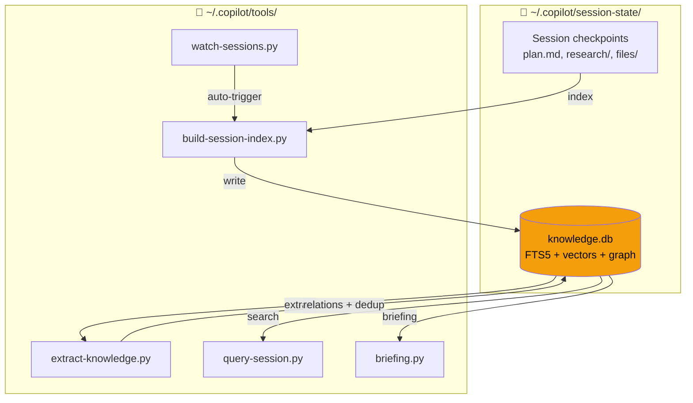

# Copilot Session Knowledge

> Cross-session memory for AI coding agents — never repeat past mistakes.

[](LICENSE)
[]()
[]()
[]()

## Table of Contents

- [Why?](#why)
- [Quick Start](#quick-start)
- [Installation](#installation)
- [Usage](#usage)
- [Sync Rollout (Local-First)](#sync-rollout-local-first)
- [Architecture](#architecture)
- [Auto-Update](#auto-update)
- [Skills & Hooks](#skills--hooks)
- [Resilience & Paused-Goal Recovery](#resilience--paused-goal-recovery)
- [Trend Scout](#trend-scout)
- [Security](#security)
- [Testing](#testing)
- [FAQ](#faq)
- [Board Import Automation](#board-import-automation)
- [Contributing](#contributing)
- [License](#license)

**Canonical docs:** [Architecture & Conventions](docs/ARCHITECTURE.md) · [Agent Rules](docs/AGENT-RULES.md) · [Install Guide](docs/INSTALL.md) · [Usage](docs/USAGE.md) · [Hooks](docs/HOOKS.md) · [Confidence Gate](docs/CONFIDENCE-GATE.md) · [Skills](docs/SKILLS.md) · [Telemetry & Contracts](docs/TELEMETRY.md) · [Operator Playbook](docs/OPERATOR-PLAYBOOK.md) · [Resilience Runbook](docs/RESILIENCE-RUNBOOK.md) · [Board Import](docs/BOARD-IMPORT.md) · [Connectivity Troubleshooting](docs/CONNECTIVITY-TROUBLESHOOTING.md)

## Why?

Each Copilot CLI / Claude Code session accumulates valuable experience — bugs encountered, patterns discovered, architecture decisions made. But every new session starts from zero, repeating past mistakes.

This tool **indexes all session data** into SQLite FTS5, **auto-extracts knowledge** into 7 categories (mistakes, patterns, decisions, tools, features, refactors, discoveries), and provides **search + briefing** so your AI agent never forgets what it learned.

## Quick Start
```bash
# 1. Clone
git clone https://github.com/magicpro97/copilot-session-knowledge.git ~/.copilot/tools

# 2. Build knowledge base
sk index build && sk index extract
# fallback: python3 ~/.copilot/tools/sk.py index build && python3 ~/.copilot/tools/sk.py index extract

# 3. Get a briefing
sk briefing "your task description"
# fallback: python3 ~/.copilot/tools/briefing.py "your task description"
```
After `install.py --test` (full install), the `sk` launcher is added to your user PATH. Already-running Windows terminals may need `$env:Path = "$env:USERPROFILE\.copilot\bin;$env:Path"` or a restart before `sk` resolves; until then use `python "$env:USERPROFILE\.copilot\tools\sk.py"`.
That's it. Your AI agent now has memory across sessions.

## Installation
> 📖 **Full install guide (all methods, verification, upgrade, uninstall):** [docs/INSTALL.md](docs/INSTALL.md)

### Prerequisites

- Python 3.10+ (no pip packages needed — pure stdlib)
- Copilot CLI (`~/.copilot/session-state/`) and/or Claude Code

> **Note:** Use `python3` on macOS/Linux, `python` or `py` on Windows.

### Recommended (auto-update enabled)

```bash
git clone https://github.com/magicpro97/copilot-session-knowledge.git ~/.copilot/tools
python3 ~/.copilot/tools/build-session-index.py
python3 ~/.copilot/tools/extract-knowledge.py
python3 ~/.copilot/tools/migrate.py
python3 ~/.copilot/tools/install.py --test
# → sk launcher auto-provisioned on PATH; use `sk` from here on

# macOS: install LaunchAgents (auto-start watcher + daily auto-update)
python3 ~/.copilot/tools/launchd/install-launchd.py
```

### Other install paths

- [Method 2 — Manual Copy](docs/INSTALL.md#method-2--manual-copy)
- [Method 3 — Windows (PowerShell)](docs/INSTALL.md#method-3--windows-powershell)
- Windows / no-PATH fallback: `python "$env:USERPROFILE\.copilot\tools\sk.py"`

📖 **Full command surface:** [docs/USAGE.md — sk unified CLI](docs/USAGE.md#sk--unified-cli)

## Usage

> 📖 **Full command reference with `sk` namespaces:** [docs/USAGE.md](docs/USAGE.md)

`sk` is the unified CLI front door. Common commands:

```bash
sk briefing "task"
sk query "error message"
sk learn --mistake "..." "..."
sk index build && sk index extract
sk tentacle create <name> --scope "src/**/*.py" --desc "..."
sk update && sk browse --port 8080 --token TOKEN
```

Each `sk` command delegates to the underlying script; all scripts remain directly invocable as a fallback. See [docs/USAGE.md#sk--unified-cli](docs/USAGE.md#sk--unified-cli) for all namespaces (`index`, `sync`, `checkpoint`, `profile`, `context`, `scout`).

### Briefing (before every task)

```bash
brief "implement user CRUD"          # Compact ~500 tokens
brief "implement user CRUD" --full   # Full detail ~3K tokens
brief --auto                         # Auto-detect from git state
brief "review auth PR" --mode review # Mode-aware profile
brief "task" --json --compact        # Programmatic/compact output
```

### Search

```bash
qs "search terms"                    # Compact results
qs "docker" --type research          # Filter by doc type
qs --mistakes                        # View past errors
qs --detail 2045                     # Full entry by ID (includes Snippet freshness: fresh|drifted|missing|unknown)
qs "deployment error" --semantic     # Semantic search (compact output; no feedback fragment)
qs --file src/auth.py                # Entries touching a specific file
qs --module auth                     # Entries for a module or directory
qs --diff                            # Entries for current git diff files
qs "search" --export json --budget 2000
```

### Advanced Query Flags

Column-scoped BM25 search and session inspection (schema v8):

```bash
qs "bug" --in user                   # Search only in user_messages column
qs "deploy" --in assistant           # Search only in assistant_messages column
qs --from <session-id>               # Show all entries from a specific session
qs "error" --snippet                 # Include surrounding context snippet
qs --session-raw <session-id>        # Dump raw events for a session
```

### Index Health

```bash
sk index status          # Row counts, FTS integrity, offset coverage
```

### Recall Telemetry (Phase 5)

```bash
sk index health --recall         # Recall-only telemetry dashboard
sk index health --recall --json  # Recall-only JSON stats
```

- Telemetry is intentionally lean (`recall_events`): counts/IDs/size only, no verbose output bodies.
- `qs --detail <id>` logs `detail_open` per call (stateless): existing ID → `hit_count=1` and `selected_entry_ids=[id]`; missing ID → `hit_count=0` and `selected_entry_ids=[]`.
- Default `qs "query"` telemetry aggregates the full emitted surface (primary search block + `sessions_fts` block + knowledge-entry block).
- If `recall_events` is missing (older DB), recall commands still run (best-effort telemetry write).
- No Phase 5 browse UI route, contextual summary, or provider rerank behavior.

### Record Knowledge

```bash
learn --mistake "Title"  "What went wrong"     --tags "docker"
learn --pattern "Title"  "Best practice"       --tags "lambda"
learn --decision "Title" "Architecture choice" --tags "cdk"
learn --mistake "Title"  "Description" --task "memory-surface" --file "briefing.py"
learn --pattern "FTS sanitizer fix" "Strip operators before MATCH" --code-location "query-session.py:120-142"
learn --mistake "Title"  "Description" --json  # Machine-readable JSON output
```

### Tentacle Orchestration (runtime-bundle workflow)

Multi-agent parallel execution via scoped work units. The runtime-bundle workflow:

```bash
# 1. Create a tentacle with scope + briefing + skills
sk tentacle create api-export \
  --scope "src/api/*.py" --desc "Export API endpoints" --briefing \
  --skill karpathy-guidelines --skill code-reviewer
# fallback: python3 ~/.copilot/tools/tentacle.py create api-export ...

# 2. Add atomic todo items (one per agent delegation unit)
sk tentacle todo api-export add "Generate OpenAPI schema"

# 3. (Optional) Prepare isolated git worktree
sk tentacle worktree api-export prepare
sk tentacle worktree api-export status

# 4. (Optional) Pre-materialize isolated context bundle
#    Writes briefing.md, instructions.md, skills.md, session-metadata.md,
#    recall-pack.json (machine-readable JSON recall), and manifest.json to bundle/
sk tentacle bundle api-export

# 5. Dispatch — bundle is default; prompt stays lean and surfaces bundle_path
sk tentacle swarm api-export \
  --agent-type general-purpose --model claude-sonnet-4.6 --briefing      # single prompt
sk tentacle swarm api-export --output parallel --briefing  # one dispatch per todo
sk tentacle swarm api-export --output json --briefing      # structured JSON + bundle_path
sk tentacle swarm api-export --worktree         # include worktree path reference
sk tentacle dispatch api-export --worktree      # single-agent alias with worktree
sk tentacle swarm api-export --no-bundle        # rare tiny-prompt opt-out

# 6. Monitor runtime (read-only operator view)
sk tentacle status           # Dashboard: all tentacles + states

# 7. After agents finish: run verification commands, record results, and close (orchestrator only)
sk tentacle verify api-export "python3 test_fixes.py" --label "tests"
sk tentacle handoff api-export "Done. Learned X" --learn
sk tentacle complete api-export  # Marks done, unblocks git commit
sk tentacle complete api-export --auto-verify "python3 test_fixes.py"
sk tentacle worktree api-export cleanup
# fallback for all: python3 ~/.copilot/tools/tentacle.py <subcommand> <args>
```

> `--output parallel` maximises parallelism (one agent per todo). `swarm` and `dispatch`
> materialize a runtime bundle by default; `--briefing` writes bounded live recall into
> `briefing.md` and machine-readable `recall-pack.json`. `--output json --briefing` is
> supported when the default bundle is enabled and returns `bundle_path`. `resume` refreshes
> a single `AUTO-RECALL` block in `CONTEXT.md`.
> `tentacle.py complete` is the verification/closure step: it marks the tentacle done, clears the dispatched-subagent marker (unblocking `git commit`/`git push`), and auto-learns from
> `handoff.md`. `--auto-verify <cmd>` (optional, fail-open) runs a verification command and persists evidence before closing. See [docs/USAGE.md](docs/USAGE.md) for the full recall/runtime details.

**Commit restriction:** Sub-agents must not run `git commit` or `git push`. With
`install.py --install-git-hooks`, both are **blocked at the git level** while the
`dispatched-subagent-active` marker is active for the current repo. Even without hooks, only the
orchestrator should commit after review + verification. Enforcement is local-only.

> **Cross-repo isolation:** marker entries carry `git_root`, so repo A's active tentacle does not
> block commits in repo B. Old entries without `git_root` conservatively block as before.

> **Stuck marker:** markers expire after 4 hours. Manual clear: `sk tentacle complete <name>`
> (or remove `~/.copilot/markers/dispatched-subagent-active` directly).

### Tentacle Next Step

```bash
# Show the grounded next step for a named tentacle (read-only)
sk tentacle next-step api-export         # First pending todo + checkpoint context
sk tentacle next-step api-export --all   # All pending todos
sk tentacle next-step api-export --briefing        # + live knowledge briefing
sk tentacle next-step api-export --no-checkpoint   # Skip checkpoint context
sk tentacle next-step api-export --format json     # JSON output
# fallback: python3 ~/.copilot/tools/tentacle.py next-step api-export <args>
```

### Project Context

```bash
# Generate deterministic project-context.md (repo structure, profile, hooks, test expectations)
sk context project                # Write to session files/ dir
sk context project --stdout       # Print to stdout only
sk context project --output PATH  # Write to explicit path
sk context project --profile python  # Force a preset profile
sk context project --list-profiles   # Show available profiles
```

No AI generation, no network access. The artifact is derived purely from repo/profile facts and is deterministic for the same repo state.

### Checkpoint Lifecycle

```bash
# Save
sk checkpoint save --title "Auth done" --overview "JWT added"
# Read back (read-only)
sk checkpoint restore --list
sk checkpoint restore --show latest
sk checkpoint restore --export latest --format json
# Compare
sk checkpoint diff --from 1 --to latest
sk checkpoint diff --summary
sk checkpoint diff --from 1 --to latest --pager   # external pager (safe allowlist)
# fallback: python3 ~/.copilot/tools/checkpoint-save.py / checkpoint-restore.py / checkpoint-diff.py <args>
```

### Web UI (browse.py)

A read-only local web UI for browsing the knowledge base from a browser. Bound to `127.0.0.1` only — not accessible from other machines.

```bash
python browse.py --port 8080 --token YOUR_TOKEN
# Then open http://127.0.0.1:8080/?token=YOUR_TOKEN in your browser
# Omit --port for a random free port (printed on startup)
```

Security: token is required on every request; `Content-Security-Policy` blocks inline scripts. Do not expose this port externally.

#### Primary UI — Next.js (root routes)

The browse app serves the modern Next.js 16 frontend at root routes (`/*`). Start at `http://127.0.0.1:8080/sessions?token=YOUR_TOKEN`. Legacy `/v2/*` routes redirect to these canonical paths.

| Route | Description |
|-------|-------------|
| `/sessions` | Session list |
| `/sessions/[id]` | Session detail (real UUID paths) + timeline/mindmap/checkpoints |
| `/search` | Full-text + semantic search |
| `/insights` | Knowledge insights (Overview, Knowledge, Retro, Search Quality, Live feed tabs) |
| `/graph` | Graph workspace: Insight (default) + Evidence + Similarity + Communities |
| `/settings` | Preferences + host management |
| `/chat` | Operator console — authenticated Copilot CLI execution surface |

To rebuild the primary UI after editing `browse-ui/src/`, run `cd browse-ui && pnpm build`; to build and launch local browse in one step, run `cd browse-ui && node scripts/run-local.mjs -- --port 8080 --token YOUR_TOKEN --no-tunnel`.

#### Legacy UI (v1, deprecated but still supported)

Classic Python-rendered routes (F1–F15 including `/`, `/sessions`, `/graph`, `/search`, `/dashboard`, `/embeddings`, `/live`, `/eval`, `/compare`, `/session/<id>.md`, and mindmap; F8 dark mode via `prefers-color-scheme`) remain available for backward compatibility. See [docs/USAGE.md](docs/USAGE.md) for the full route listing.

### Profile Lifecycle

Build, share, and deploy custom workflow profiles:

```bash
sk profile build --name myteam \
  --hooks dangerous-blocker.py commit-gate.py --phases CLARIFY BUILD TEST COMMIT
sk profile export --profile myteam --output myteam.json
sk profile import --file myteam.json
sk setup --profile myteam   # deploy
# fallback: python3 ~/.copilot/tools/profile-builder.py / profile-export.py / profile-import.py / setup-project.py <args>
```

📖 **Full command reference:** [docs/USAGE.md](docs/USAGE.md)

## Sync Rollout (Local-First)

Sync is **local-first and optional**: local `knowledge.db` remains the primary read/query source; remote sync is transport/storage only.

- **Config** (`~/.copilot/tools/sync-config.json`, single `connection_string`):
  - `sk sync config --setup https://gateway.example.com`
  - `sk sync config --setup-env SYNC_GATEWAY_URL`
  - Setup accepts an HTTP(S) gateway URL (not a raw Postgres/libSQL DSN).
  - `sk sync config --status --json`
  - `sk sync config --get`
  - `sk sync config --clear`
  - fallback: `python3 ~/.copilot/tools/sync-config.py <args>`
- **Runtime**:
  - `sk sync run --once|--daemon|--interval 30|--push-only|--pull-only`
  - Backlog-aware adaptive per-cycle sync limits are applied automatically (`sync_txns` volume + relation-heavy queue boost).
  - Pull consumes multiple pages per cycle (`MAX_PULL_PAGES_PER_CYCLE`) and refreshes local retrieval surfaces (`knowledge_fts`, `ke_fts`) for touched rows after canonical apply.
  - If no `connection_string` is configured, daemon stays local-only (no hard failure).
  - fallback: `python3 ~/.copilot/tools/sync-daemon.py <args>`
- **Diagnostics**:
  - `sk sync status --watch-status|--health-check|--audit [--json]`
  - Browse `/healthz` advertises `sync_status_endpoint: "/api/sync/status"`.
  - Browse `/api/sync/status` is read-only local queue/failure/config/cursor status.
  - fallback: `python3 ~/.copilot/tools/sync-status.py <args>`
- **Gateway in this repo**: `sync-gateway.py` is **reference/mock only** (not production authority), exposing `/sync/push`, `/sync/pull`, `/healthz`.
- **Default provider rollout recommendation**: keep the same HTTP gateway contract, with Neon (backing Postgres) + Railway (thin gateway host) as the default rollout path. This is a recommendation, not a vendor lock.

## Architecture

> 📖 **Full architecture, script inventory, and conventions:** [docs/ARCHITECTURE.md](docs/ARCHITECTURE.md)


```mermaid
flowchart TD
  subgraph Data["📁 ~/.copilot/session-state/"]
    RAW["Session checkpoints<br/>plan.md, research/, files/"]
    DB[("knowledge.db<br/>FTS5 + vectors + graph")]
  end

  subgraph Tools["🔧 ~/.copilot/tools/"]
    IDX[build-session-index.py]
    EXT[extract-knowledge.py]
    QRY[query-session.py]
    BRF[briefing.py]
    WCH[watch-sessions.py]
  end

  RAW -->|index| IDX -->|write| DB
  DB -->|extract| EXT -->|relations + dedup| DB
  DB -->|search| QRY
  DB -->|briefing| BRF
  WCH -->|auto-trigger| IDX

  style DB fill:#f59e0b,color:#000
```

**How it works:**

1. **Index** — `build-session-index.py` Phase 1+2 via `providers/` → SQLite FTS5 (schema v8)
2. **Extract** — `extract-knowledge.py` classifies into 7 types, deduplicates by content hash
3. **Search** — BM25 keyword + column-scoped (`--in user/assistant/tool`) + optional semantic vector (RRF)
4. **Watch** — `watch-sessions.py` adaptive polling (5 s/30 s/300 s tiers), auto re-indexes
5. **Hooks** — unified `hook_runner.py` (1 process/event), fail-open, HMAC-signed markers
6. **Host metadata** — `host_manifest.py` is the single source of truth (Copilot CLI + Claude Code only)
7. **Tentacles** — `.octogent/` stores local multi-agent orchestration state (gitignored)

**Schema:** v1–v6 (legacy) → v7 (two-phase + `event_offsets`) → v8 (`sessions_fts` FTS5) → v9–v14 (eval, sync, benchmark) → v15 (confidence backfill) → v16 (error lifecycle) → **v17** (current: `briefing_deliveries`). Run `python3 ~/.copilot/tools/migrate.py` to upgrade.

## Auto-Update

```bash
sk update                  # Auto-update (24h cooldown)
sk update --force          # Force update now
sk update --doctor         # Health check
sk update --restart-watch  # Restart watcher
sk update --watch-status   # Watcher status
```

Smart pipeline analyzes `git diff` to run only what changed. Post-merge hook auto-triggers on `git pull`.

📖 **Details:** [docs/AUTO-UPDATE.md](docs/AUTO-UPDATE.md)

## Skills & Hooks

16 built-in skills (session-knowledge-creator, agent-creator, hook-creator, tentacle-creator, tentacle-orchestration, workflow-creator, skill-creator, find-skills, agent-instructions-auditor, forge-ecosystem, code-reviewer, task-step-generator, conductor-creator, project-onboarding, detective-investigation, karpathy-guidelines) plus 10 hook templates for quality enforcement.

`setup-project.py` is the canonical project deployment surface: it reads the skill list from `INSTALL_ITEMS` and deploys all 16 skills to `.github/skills/<skill-name>/SKILL.md` in the **target project**. Vendored skills (`karpathy-guidelines`) are additionally deployed to `.claude/skills/` for Claude Code. To make built-in skills available globally across all projects, run `install.py --deploy-global-skills`; it creates or refreshes `~/.copilot/skills/<skill-name>/` from `tools/skills/<skill-name>/`, including bundled references and assets. `install.py --deploy-skill` remains project-scoped. **Auto-update for globally installed skills:** changes under `skills/` now run `install.py --deploy-global-skills` before the update-only project/global refresh path, so Copilot CLI global scope (`~/.copilot/skills/`) is initialized and then kept current. `~/.claude/skills/` does not receive global auto-updates. When a skill is available globally, **do not redeploy it at project scope** — Copilot deduplicates by skill name but having the same name at both scopes adds catalog noise and increases load.

Unified hook runner architecture — 1 Python process per event with fail-open, HMAC-signed markers, audit logging, and tamper protection. Hook deployment is **Copilot CLI only**; Claude Code does not support the `hook_runner.py` format.

**Dispatched-subagent git guard (phase 3+):**
- `install.py --install-git-hooks` deploys repo-local `pre-commit`/`pre-push`; these are the primary enforcement surface for subagent git restrictions (filesystem-level), while `preToolUse` is defense-in-depth only.
- Marker format uses `active_tentacles` objects (`{name, ts, git_root, tentacle_id}`); dedupe is by `tentacle_id` (fallback `(name, git_root)`), and `git_root` canonical matching provides cross-repo isolation.
- Old entries without `git_root` conservatively block; for immediate isolation after upgrade, clear/recreate active markers (`tentacle.py complete <name>` or remove marker file, then re-dispatch).
- Same-repo collisions auto-resolve to `<name>-<uuid[:8]>`; runtime writes the active slug in `manifest.json` (`slug`) and `session-metadata.md` (`Slug:`). Isolation is marker-level only: overlapping files in one repo can still conflict.
- `auto-update-tools.py` does not reinstall per-repo git hooks automatically; after hook updates, re-run `python3 ~/.copilot/tools/install.py --install-git-hooks` in every protected repo.

```bash
python3 ~/.copilot/tools/install.py --deploy-skill        # Deploy skill to project
python3 ~/.copilot/tools/install.py --deploy-global-skills # Deploy built-in skills globally
python3 ~/.copilot/tools/install.py --deploy-hooks        # Deploy enforcement hooks (Copilot CLI)
python3 ~/.copilot/tools/install.py --lock-hooks          # Lock hooks (tamper protection)
python3 ~/.copilot/tools/install.py --install-git-hooks   # Install pre-commit/pre-push into current repo

# Project setup with a workflow profile
sk setup --profile python                # Python hook bundle + WORKFLOW.md
python3 ~/.copilot/tools/install-project-hooks.py --profile mobile  # Mobile hooks standalone

# Custom profile lifecycle
sk profile build --name myteam --hooks dangerous-blocker.py --phases BUILD TEST COMMIT
sk profile export --profile myteam --output myteam.json
sk profile import --file myteam.json
```

**Session-start hooks** run through the unified `hook_runner.py` architecture (1 Python process per event, fail-open, HMAC-signed markers, audit logging) and automatically refresh the codebase map (`codebase-map.py`) at the start of each session — no manual step required.

**Session lifecycle hooks** run through `hook_runner.py`: `sessionEnd` performs marker cleanup + sync flush signal, and `agentStop`/`subagentStop` perform best-effort dispatched-subagent marker cleanup using stop payload hints.
Hooks never auto-save checkpoints.
To save a checkpoint yourself, run `sk checkpoint save`.

### Context Load Management

Excessive context load in Copilot sessions comes primarily from **duplicate skills** and **overly broad instruction surfaces** — not from the unified hook runner (which is a single process per event and is efficient). To keep load manageable:

- **Minimal-context-first**: start with `sk briefing --compact` (~500 tokens) before escalating to `--full`. Instruction files with `applyTo: '**/*'` inject into every context — scope them narrowly (e.g., `**/*.ts`) when they apply only to specific file types.
- **Progressive escalation**: retrieve only what the current step needs. Full session history and semantic search are available but should be requested on demand, not injected by default.
- **Propagation discipline**: when a skill or instruction is promoted to global scope (`~/.copilot/skills/`, `~/.github/instructions/`), remove the project-local copy to prevent duplication. Audit by manually comparing `~/.copilot/skills/` against `.github/skills/` in each project and removing any skill that exists at both levels. (`hooks/lint-skills.py --all` validates schema — it does not detect cross-scope duplicates.)

📖 **Skills reference:** [docs/SKILLS.md](docs/SKILLS.md) · **Hooks reference:** [docs/HOOKS.md](docs/HOOKS.md)

## Resilience & Paused-Goal Recovery

When the session-end hook detects an active or awaiting-gate goal, it writes a pause breadcrumb to `.octogent/goal-resume-breadcrumb.json`. At the next session start, **both** the Python (`hook_runner.py`) and native Rust (`sk hooks run sessionStart`) paths prepend a resume banner before the normal briefing output (the banner shows the stored pause-reason label; currently only session end writes the breadcrumb — `context compaction` and `quota limit` are recognized future-compatible labels, not yet active breadcrumb writers):

```
⏸  Paused goal: <goal title>  (session end | context compaction | quota limit)
▶  Run: sk tentacle goal resume
```

### Quick Recovery Sequence

```bash
# 1. Re-activate the paused goal (paused → active)
sk tentacle goal resume

# 2. Check the compact resilience dashboard
sk tentacle goal resilience-status

# 3. Re-dispatch tentacle waves for remaining work, or re-run the verify-loop
sk tentacle goal verify-loop [--escalate]
```

> 📖 **Detailed recovery flows** (compaction, interruption, awaiting-gate, quota/rate-limit):
> **[docs/RESILIENCE-RUNBOOK.md](docs/RESILIENCE-RUNBOOK.md)**

## Trend Scout

`trend-scout.py` discovers relevant GitHub repositories via the **GitHub Search API** using a **multi-lane discovery** architecture and creates or updates structured issues in the target repo for review. Each lane is an independent search channel with its own keyword set, topic filters, language constraint, and `min_stars` threshold — allowing the pipeline to surface both language-specific repos and language-agnostic adjacent projects in parallel.

```bash
sk scout run                         # Full pipeline
sk scout run --dry-run               # Preview without creating issues
sk scout run --search-only           # Discovery + shortlist, no issues
sk scout run --explain               # Emit a discovery explainability artifact
sk scout run --limit 3               # Cap issues created this run
sk scout run --repo owner/repo       # Override target repo
sk scout run --config path.json      # Custom config file
sk scout run --token TOKEN           # Explicit GitHub token (overrides GITHUB_TOKEN env)
sk scout run --force                 # Bypass grace window; force a new run
# fallback: python3 ~/.copilot/tools/trend-scout.py <args>
```

Requires a `GITHUB_TOKEN` env var (or `--token TOKEN`). `--limit` caps new creates only; marker-matched open issues are updated in place. Supports multi-lane discovery (`lanes[]` in config), gold-set watchlists (`trend-scout-goldset.json`), optional GitHub Models analysis (`analysis.enabled=true`), veto gates, and a configurable grace window. Edit `trend-scout-config.json` to tune all settings.

**GitHub Actions workflow:** `.github/workflows/trend-scout.yml` runs daily at 07:00 UTC (`contents: read`, `issues: write`, `models: read`). Manual `workflow_dispatch` supports `dry_run`, `search_only`, `repo`, `limit`, `force`, `explain` inputs; `explain=true` uploads the discovery JSON as an artifact. **Hook noise control:** Trend Scout is **not** wired to `preToolUse`/`postToolUse` — keep cron/workflow driven. 📖 **Details:** [docs/USAGE.md#trend-scout](docs/USAGE.md#trend-scout)
## Retrospective
`sk retro` computes a composite operator score (0–100) across knowledge, skills, hooks, and git signals; run `sk retro`, `sk retro --mode repo`, `sk retro --json`, `sk retro --score`, or `sk retro --subreport behavior` (behavior section, local mode only).
Local mode (`--mode local`) includes knowledge, skills, hooks, and git, but may report `score_confidence=low` with distortion flags like `hook_deny_dry_noise` or `skills_unverified`; repo mode (`--mode repo`) is git-only, cleaner, and CI-safe for trend tracking. The JSON payload includes additive top-level fields: `scout` (read-only Trend Scout coverage health) and `toward_100` (ranked per-section gap diagnostics with metric-derived barriers explaining what pulls each score below 100). Both fields are informational only and do **not** affect `retro_score`, `weights`, or existing subscores; surfaces that do not recognise them degrade gracefully. Browse surfaces: `/v2/insights` (Retrospective card with scout coverage panel), `http://localhost:<port>/retro?token=<token>`, and `/api/retro/summary?mode=repo`. Trigger `retro.yml` via `workflow_dispatch` for a read-only markdown artifact/job summary with score, confidence, distortions, accuracy notes, and recommended actions. For commit-keyed comparison, run `sk benchmark record`, `sk benchmark list --limit 5`, or `sk benchmark compare --commits <older> <newer>`; compare output includes `retro_gap` and `health_gap` gap-to-target fields (100 minus score) so measurable progress is explicit; snapshots live in `benchmark_snapshots` (default DB: `~/.copilot/session-state/knowledge.db`, override with `--db PATH`) and the manual-only `.github/workflows/benchmark.yml` workflow uploads the DB + JSON artifact without writing back to the branch. 📖 **Operator details:** [docs/OPERATOR-PLAYBOOK.md#retrospective](docs/OPERATOR-PLAYBOOK.md#retrospective)

## Security

- **Parameterized SQL** — zero SQL injection vectors
- **FTS5 sanitization** — strips operators (`OR`, `AND`, `NOT`, `NEAR`, `*`, `"`)
- **No pickle** — JSON serialization only (legacy pickle detection + warning)
- **Atomic locks** — `O_CREAT | O_EXCL` eliminates TOCTOU race conditions
- **API key protection** — config files chmod `0o600`, env vars preferred
- **Input limits** — title 200 chars, content 10K chars, FTS query 500 chars
- **Injection scanning** — `learn.py` scans entries against 15 regex patterns
- **Hook tamper protection** — OS immutable flags + SHA256 manifest verification

📖 **Full security policy:** [SECURITY.md](SECURITY.md)

## Testing

Canonical quality-gate entry points (repo root):

```bash
python3 test_security.py      # security regression tests
python3 test_fixes.py         # functional and integration regression tests
python3 run_all_tests.py      # discovers and runs all test_*.py (root + tests/)
```

Additional tests live under `tests/` (browse, sync, hooks, profile, trend scout, UI, and more); run them from the repo root:

```bash
python3 tests/test_browse.py
python3 tests/test_trend_scout.py
python3 tests/test_visual_snapshot.py
# ... or run them all at once:
python3 run_all_tests.py
```

See [`tests/README.md`](tests/README.md) for the path-convention details.

## FAQ

**Q: Does it work with Claude Code?** A: Yes. `claude-adapter.py` parses Claude Code JSONL sessions into the common format.
**Q: Do I need an API key?** A: No — FTS5 keyword search and TF-IDF fallback work offline. Keys are optional for semantic search (OpenAI, Fireworks, OpenRouter).
**Q: Where is the data stored?** A: `~/.copilot/session-state/knowledge.db` — a single SQLite file with FTS5 indexes.
**Q: Does it work on Windows?** A: Yes. All scripts include Windows encoding fixes. Use `python` instead of `python3`. POSIX-style home paths (Git Bash, WSL, Cygwin) are auto-normalised to native Windows paths.
**Q: How do I update?** A: `sk update --force` or `git pull` (post-merge hook handles the rest).
**Q: Will hooks crash my AI agent?** A: No. The unified hook runner uses fail-open architecture — if any rule crashes, it logs the error and allows the action to proceed.

## Troubleshooting

### Copilot CLI auto-heal

If `copilot update` fails with an error like:

```
ENOENT: no such file or directory, rename .../.copilot/pkg/universal/.replaced-1.0.35-<pid>-<ts>
```

or `EPERM` on a rename inside `pkg/universal/`, run the healer:

```bash
python ~/.copilot/tools/copilot-cli-healer.py --status   # Diagnose
python ~/.copilot/tools/copilot-cli-healer.py --heal     # Fix
python ~/.copilot/tools/copilot-cli-healer.py --update   # Heal + retry copilot update
```

**Root cause:** The upstream Copilot CLI Node updater calls `fs.rename(src, dst)` without checking that `src` exists, leaving stale `.replaced-*` dirs and `pkg/tmp/` partial downloads behind. The healer removes these safely.

To prevent recurrence, register a daily scheduled task:

```bash
python ~/.copilot/tools/copilot-cli-healer.py --install-schedule
# or:
python ~/.copilot/tools/install.py --install-healer
```

📖 **Details:** [docs/copilot-cli-healer.md](docs/copilot-cli-healer.md)

## Quality Gates

Motivated by a C1-class bug where a misindented top-level block caused a `SyntaxError` in `watch-sessions.py` that slipped past review. The following gates make this class of error impossible to commit again:

- **`scripts/check_syntax.py`** — stdlib-only CLI; walks the repo and runs `py_compile` on every `.py` file. Prints `file:line: error` for each failure, exits 1 on any error.
- **`run_all_tests.py`** — stdlib-only test runner; discovers and runs all `test_*.py` files, prints a pass/fail table, and exits non-zero on any failure.
- **`hooks/rules/syntax_gate.py`** — `preToolUse` hook; blocks `edit`/`create` on `*.py` files if the new content has a syntax error. Registered in the unified hook runner via `hooks/rules/__init__.py`.
- **`.github/workflows/ci.yml`** — GitHub Actions CI; runs syntax check then all tests on every push and pull request (ubuntu-latest, Python 3.11).
- **`requirements-dev.txt`** — optional dev-only deps (`ruff`, `pytest-cov`); core runtime and all quality gates work without installing it.

## Board Import Automation

Batch-create GitHub issues from a WBS JSONL file and add them to a Project v2 board with priority fields set — using only `gh` CLI, stdlib Python, and PowerShell GraphQL (no extra dependencies).

```bash
# Validate JSONL offline and generate example payloads
python wbs-issue-gen.py --validate wbs-issues.jsonl
python wbs-issue-gen.py --generate 5 --output wbs-issues.jsonl
# Create issues via REST and add them to Project v2; see docs/BOARD-IMPORT.md
```

The `wbs-issue-gen.py` validator/generator (at repo root) handles schema validation, dry-run introspection, and example generation — all offline. Labels, milestone, assignees, priority, and a `context` metadata block (never sent to GitHub) are supported.

📖 **Full operator reference:** [docs/BOARD-IMPORT.md](docs/BOARD-IMPORT.md)

## Contributing

See [CONTRIBUTING.md](CONTRIBUTING.md) for guidelines on reporting bugs, suggesting features, and submitting pull requests.

## License
[MIT](LICENSE) © [magicpro97](https://github.com/magicpro97)
