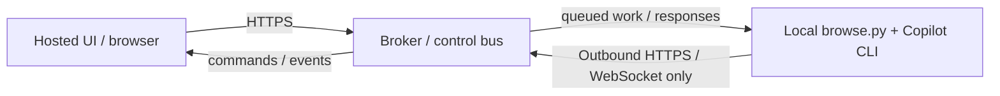

# Hosted Shell Architecture

> Design specifications for the hosted browse-UI operating as a remote shell over Copilot CLI
> backends. Covers issues **#36** (localhost bootstrap), **#37** (same-origin relay), **#41**
> (capability/version negotiation), and the hosted-connectivity follow-ups **#49**, **#62**, **#64**,
> and **#68**.
>
> **Facts** = verified, reproducible. **Interpretation** = qualified inference. **Actions** =
> executable next steps. **Verification evidence** = command or file ref that proves the claim.

---

## 1. Localhost Auto-Discovery / Bootstrap (#36)

### 1.1 Context

**Facts:**
- The hosted UI (`https://agents.linhngo.dev`) is served over HTTPS. Standard browser
  mixed-content rules block `http://` non-loopback calls from HTTPS pages unconditionally.
- Loopback addresses (`127.0.0.1`, `localhost`) are **private-network addresses** subject to
  the [Private Network Access (PNA)](https://wicg.github.io/private-network-access/) spec.
  PNA/LNA behaviour for HTTPS → HTTP loopback requests is **browser-dependent**:
  - Chromium and Edge: local-network / loopback access can require a browser permission prompt
    and a preflight response with `Access-Control-Allow-Private-Network: true`.
  - Safari and Firefox: current implementations do not use the Chromium PNA/LNA header flow;
    requests still depend on standard CORS, browser policy, and deployment settings.
- `browse.py` **currently implements HTTP loopback only** (binds to `127.0.0.1:8765`).
  A future HTTPS loopback companion via mkcert is a design aspiration documented in §1.2;
  it is **not yet shipped**.
- The **shipped** loopback bootstrap uses PNA over HTTP and is documented in **§4**.
- `browse-ui/src/lib/host-profiles.ts · checkHostCompatibility()` emits an informational
  `pna-required` note (not a hard error) for HTTP loopback entries added from HTTPS origins.
  _Evidence: `grep -n "PNA\|pna" browse-ui/src/lib/host-profiles.ts`_
- `browse-ui/src/providers/host-provider.tsx` probes `http://127.0.0.1:8765/.well-known/browse-host`
  then `http://localhost:8765/.well-known/browse-host` on hosted (non-local) origins with no
  explicit remote host configured (issue #49).
  _Evidence: `grep -n "well-known/browse-host" browse-ui/src/providers/host-provider.tsx`_

**Interpretation:** HTTP loopback from a hosted HTTPS UI is browser- and policy-dependent.
Chromium/Edge require the `--hosted-bootstrap` CORS/PNA response path and may prompt the user
for local-network access. Safari/Firefox may follow a different CORS-only path, but an HTTPS
tunnel (Cloudflare Tunnel, ngrok) remains the reliable fallback when auto-detection is blocked.
Non-loopback HTTP hosts are not reachable from HTTPS hosted pages.

### 1.2 Future HTTPS Loopback Design (Aspirational — Not Yet Shipped)

> **Note:** The shipped loopback bootstrap uses PNA over HTTP (`--hosted-bootstrap`), documented
> in **§4**. The design below describes a future HTTPS loopback path via mkcert that eliminates
> the browser-dependency on PNA support.

```
Hosted UI (HTTPS)
      │
      │  probe: GET https://127.0.0.1:8766/healthz
      │  (explicit "Detect local backend" button only — no silent background probe)
      │
      ▼
browse.py  ←  mkcert-issued cert  ←  installer provisions trust anchor
  :8765 (HTTP, same-origin default)
  :8766 (HTTPS, loopback companion, optional)
```

**Probe endpoint contract:**

| Endpoint | Method | Auth | Response |
|---|---|---|---|
| `https://127.0.0.1:8766/healthz` | GET | None (probe only) | `200 {"status":"ok","version":"<semver>","protocol_version":<int>}` |
| `https://127.0.0.1:8766/api/operator/capabilities` | GET | `Authorization: Bearer <token>` | See §3 |

**Port discovery/collision rules:**
1. Default probe port: `8766` (HTTPS companion), fallback `8765` (HTTP, same-origin only).
2. If `8766` is occupied, `browse.py --https-port=<n>` overrides; the UI lets the user enter a
   custom port in the "Detect local backend" sheet.
3. Ports below 1024 are forbidden. Ports `8765–8769` are reserved for browse companions.

**Origin-policy bootstrap:**
- The HTTPS loopback cert is provisioned by the installer via `mkcert` (or equivalent local CA).
- The browser must have the local CA in its trust store; `install.py` adds it via `mkcert
  -install` (macOS/Linux/Windows).
- A future `browse.py --install-cert` sub-command wraps this for post-install operators.

**Cross-platform install path:**

| OS | CA store command | Cert output path |
|---|---|---|
| macOS | `mkcert -install` | `~/.local/share/mkcert/` |
| Linux | `mkcert -install` (adds to `nssdb`) | `~/.local/share/mkcert/` |
| Windows | `mkcert -install` (user cert store) | `%APPDATA%\mkcert\` |

**Mixed-content rules for SSE/WebSocket:**
- `EventSource` and `fetch`-streaming from HTTPS → `https://127.x.x.x` are allowed when the
  cert is trusted.
- `ws://` from HTTPS is blocked; use `wss://` on the loopback companion port.
- `http://localhost` (not `127.x.x.x`) gets a temporary browser exception in some builds; do
  not rely on it — always use the HTTPS path.

**Negative-cache TTL and failure/manual-add UX:**
- If probe returns non-2xx or times out (3 s), cache the failure for 30 s before re-probing.
- After 2 failed probes, surface the "Add host manually" sheet automatically.
- The sheet pre-fills `https://127.0.0.1:8766` as the suggested URL.
- On persistent failure, show actionable copy: _"No local backend detected. Install browse.py
  and run `sk browse --https` to enable local access."_

**Liveness vs version probe:**
- `/healthz` = liveness only (no auth, <50 ms, no DB access). Returns `{"status":"ok","protocol_version":N}`.
- `/api/operator/capabilities` = version + feature flags (requires Bearer token). Used after
  the user enters their token in the Add Host sheet.

### 1.3 Actions

1. **Add `--https` / `--https-port` flags to `browse.py`** for loopback TLS.
   `gh issue view 36` → link implementation to this issue.
2. **Extend `install.py`** with `--install-cert` that invokes `mkcert -install`.
   Target file: `install.py · provision_local_cert()`.
3. **Update `browse/core/auth.py · check_origin()`** to accept `https://` when `X-Forwarded-Proto:
   https` is present (fixes Mode 1 remote CORS issue noted in ARCHITECTURE.md).
4. **Add explicit "Detect local backend" button** to the Settings hosts sheet.
   Calls `https://127.0.0.1:8766/healthz` with a 3 s timeout.
   File: `browse-ui/src/components/settings/HostManagement.tsx`.
5. **Wire `checkHostCompatibility()` result** into the Add Host form to show `pna-required`
   guidance for HTTP loopback and a hard `mixed-content-http` error for non-loopback HTTP.

---

## 2. Same-Origin Relay / Gateway Architecture (#37)

### 2.1 Context

**Facts:**
- Remote host mode today routes every API call cross-origin from the browser.
- `use-operator-stream.ts` uses `fetch`-streaming with `Authorization: Bearer` header for remote
  hosts; this avoids `?token=` in URLs but is still cross-origin.
  _Evidence: `grep -n "Authorization" browse-ui/src/components/chat/use-operator-stream.ts`_
- CORS preflight adds one round-trip per request type; streaming is unaffected after initial
  preflight but is sensitive to tunnel idle-timeout resets.
- Tokens in `host-profiles.ts` are stored in `localStorage` (see §#42 in HOSTED-SHELL-RESEARCH.md).

**Interpretation:** A same-origin relay/BFF would eliminate browser-side CORS and token-storage
concerns but introduces a server that must be reliably available and adds deployment complexity.
A local gateway companion is a lighter path that keeps the browser direct while removing
token-in-browser-memory risk.

### 2.2 Recommended Architecture

**Short-term (ship without relay):** keep browser-direct cross-origin calls but:
- Tokens move from `localStorage` to non-extractable `IndexedDB` + `sessionStorage` (see §#42
  in HOSTED-SHELL-RESEARCH.md).
- Reconnect cursor (Last-Event-ID) lives in browser memory (see §#43 in HOSTED-SHELL-RESEARCH.md).
- Capability skew handled by §3 protocol negotiation.

**Medium-term (local gateway companion):**
```
Hosted UI (HTTPS, Firebase)
      │  same-origin calls → /api/*
      ▼
Local Gateway (browse.py --gateway, 127.0.0.1:8767)
      │  tunnels through Cloudflare to remote host(s)
      ▼
Remote browse.py (on operator machine)
```
- The local gateway owns the remote token; the browser never sees it.
- All calls from hosted UI to local gateway are `https://127.0.0.1:8767` (loopback HTTPS from
  §1).
- Gateway registers remote hosts via `POST /api/gateway/register { label, tunnel_url, token }`.
- SSE/streaming passes through the gateway as chunked HTTP; the gateway rewrites
  `Last-Event-ID` headers and cursor position.

**Streaming pass-through cost/backpressure:**
- Gateway MUST NOT buffer full SSE stream; it must pipe bytes with ≤100 ms head-of-line
  latency.
- Backpressure: if browser read-side falls behind, gateway pauses the upstream read (standard
  Go/Python async socket flow); upstream backpressure signal propagates naturally.
- Maximum in-flight buffer: 64 KiB per connection before gateway emits a synthetic
  `event: flow-pause` heartbeat to signal the browser.

**Auth-token storage on relay:**
- The local gateway stores remote tokens in the OS keychain via `keyring` (Python stdlib
  replacement: `keyring` package is allowed as it is optional; fall back to `~/.copilot/
  hosts-credentials.json` with `chmod 600`).
- The gateway issues a short-lived (15 min) session cookie to the browser for same-origin
  requests; the browser never holds the remote token.

**End-to-end auth flow:**
1. User adds remote host URL in UI → POST to local gateway.
2. Gateway probes remote capabilities, stores token in keychain, returns session cookie.
3. Browser uses session cookie for all subsequent gateway calls.
4. Gateway forwards `Authorization: Bearer <remote-token>` upstream.

**Failure semantics:**
- Gateway unreachable: UI surfaces "Local gateway not running" banner with restart command.
- Remote host unreachable: gateway returns `502`; UI shows reconnect banner.
- Token expired/revoked: gateway returns `401`; UI opens re-auth sheet.

**Local gateway companion install/update/auto-launch:**
- `install.py --gateway` installs a launchd/systemd unit for `browse.py --gateway`.
- `auto-update-tools.py` restarts the gateway unit after updates (same pattern as watcher).
- Auto-launch: the hosted UI detects absence of gateway at `/api/gateway/health`; if not found,
  prompts to run `sk browse --gateway`.

**Interaction with stream reconnect cursor (see §#43 in HOSTED-SHELL-RESEARCH.md):**
- The browser sends `Last-Event-ID` on reconnect.
- The gateway forwards this header upstream; the remote host replays from that cursor.
- If replay is unavailable (cursor expired), gateway returns `410 Gone`; browser resets to zero.

### 2.3 Actions

1. **Short-term:** move token storage to `IndexedDB` (Issue #42). No relay needed yet.
2. **Medium-term:** add `--gateway` mode to `browse.py`.
   Target: `browse/core/gateway.py` (new file).
3. **Add `GET /api/gateway/health`** to the gateway for hosted-UI probe.
4. **Update `install.py`** with `--gateway` flag to register launchd/systemd unit.
5. **Document gateway topology** in `docs/OPERATOR-PLAYBOOK.md` (separate PR).
6. **Run `gh issue comment 37 --body "Relay spec committed to docs/HOSTED-SHELL-ARCHITECTURE.md"`**
   after merging this file.

---

## 3. Capability + Protocol Version Negotiation (#41)

### 3.1 Context

**Facts:**
- `GET /api/operator/capabilities` returns `{ cli_kind, version, supported_modes,
  supported_features }`. No `protocol_version` field exists today.
  _Evidence: `grep -n "hostCapabilitiesSchema" browse-ui/src/lib/api/schemas.ts`_
- `useHostCapabilities` in `hooks.ts` fetches this on mount; it does not guard against version
  skew.
- There is no `min_ui_version` or `min_backend_version` field.

### 3.2 Compatibility Policy

**Version semantics:**
- `protocol_version` is a monotonically increasing integer. Current value: `1`.
- `min_ui_build` (optional, semver): minimum browse-ui build the backend requires.
- `min_backend_build` (optional, semver): minimum backend the UI declares it requires.

**Skew rules:**

| Condition | UI behaviour |
|---|---|
| `protocol_version` absent | Treat as `1`; all features enabled. |
| UI knows protocol `N`, backend reports `M < N` | Disable features that require `>M`. Show "Update backend for full features" banner (dismissible). |
| Backend reports `M > N` (UI is older) | Accept unknown fields silently (forward-compat). Show "Update UI" banner if `min_ui_build` is present and current build is older. |
| `min_ui_build` present and current build older | Block deep navigation; show "Please reload — a newer app is available" modal. |

**Breaking vs additive changes:**
- Additive (new optional fields, new `supported_features` values): no `protocol_version` bump.
- Breaking (field renamed, required field removed, semantic change): bump `protocol_version`.
- First planned breaking change: `protocol_version: 2` when relay gateway is introduced.

**Where the version lives:** `GET /api/operator/capabilities` only — no `Server:` header, no
separate `/api/version` endpoint. One endpoint, one fetch.

**Schema change (draft):**

```typescript
// browse-ui/src/lib/api/schemas.ts — additions to hostCapabilitiesSchema
export const hostCapabilitiesSchema = z.object({
  cli_kind: cliKindSchema,
  version: z.string().nullable().optional(),
  supported_modes: z.array(z.string()),
  supported_features: z.array(z.string()),
  // NEW ↓
  protocol_version: z.number().int().positive().optional().default(1),
  min_ui_build: z.string().optional(),   // semver, e.g. "0.9.4"
  min_backend_build: z.string().optional(),
});

// browse-ui/src/lib/api/types.ts — additions to HostCapabilities
export interface HostCapabilities {
  cli_kind: CliKind;
  version?: string | null;
  supported_modes: string[];
  supported_features: string[];
  protocol_version: number;    // defaults to 1 when absent
  min_ui_build?: string;
  min_backend_build?: string;
}
```

**Python backend (`browse/api/operator.py`) — addition:**
```python
# GET /api/operator/capabilities response (additions)
{
  "protocol_version": 1,
  "min_ui_build": None,      # set when breaking change is deployed
  "min_backend_build": None,
}
```

**Auto-discovery integration (Issue #36):**
- `/healthz` returns `{ "status": "ok", "protocol_version": 1 }` (subset only, no features).
- Full capabilities require an authenticated call to `/api/operator/capabilities`.

### 3.3 Actions

1. **Add `protocol_version` to `hostCapabilitiesSchema` and `HostCapabilities`.**
   File: `browse-ui/src/lib/api/schemas.ts`, `browse-ui/src/lib/api/types.ts`.
2. **Add `protocol_version: 1` to `browse/api/operator.py` capabilities response.**
3. **Add version-skew banner component** in `browse-ui/src/components/` triggered by
   `useHostCapabilities` when `protocol_version < CURRENT_PROTOCOL_VERSION`.
4. **Add `protocol_version` to `/healthz` response** in `browse/core/server.py`.
5. **Update `hostCapabilitiesSchema.test.ts`** to cover the new optional fields and
   default-1 behaviour.
   ```bash
   cd browse-ui && pnpm test -- schemas
   ```
6. **Run `gh issue comment 41 --body "Spec committed; draft schema in docs/HOSTED-SHELL-ARCHITECTURE.md §3"`**

---

---

## 4. Hosted Loopback Bootstrap — PNA/HTTP (Shipped, Issue #49)

> **Facts** = verified from source code. **Interpretation** = qualified inference.
> **Actions** = executable commands. **Verification evidence** = file ref or test output.

### 4.1 Discovery Endpoint Contract

**Verified fact:** `browse.py` exposes `GET /.well-known/browse-host` when running.
This endpoint is unauthenticated and returns a minimal JSON payload. No session counts,
DB paths, or user data are disclosed.

**Response schema (`browse-host/1`):**

```json
{
  "schema": "browse-host/1",
  "status": "ok",
  "auth": "open",
  "manual_token_required": false,
  "capabilities": ["discovery", "healthz", "api"],
  "cors_origins_configured": true
}
```

| Field | Meaning |
|---|---|
| `schema` | Version identifier. Current value: `"browse-host/1"`. |
| `status` | Always `"ok"` when the server is reachable. |
| `auth` | `"token"` when a Bearer token is required for `/api/*`; `"open"` otherwise. |
| `manual_token_required` | `true` when `auth === "token"` — the frontend must prompt the user for a token; do **not** invent a blank token. |
| `capabilities` | String list of declared capabilities (no private data). |
| `cors_origins_configured` | `true` when `BROWSE_CORS_ORIGINS` is non-empty. Does **not** disclose the actual origin URLs. |

_Evidence: `cat browse/routes/discovery.py`_

### 4.2 `--hosted-bootstrap` Flag

**Verified fact:** `python3 browse.py --hosted-bootstrap` does the following at startup:

1. Keeps binding to `127.0.0.1` (loopback only — not `0.0.0.0`).
2. Configures `BROWSE_CORS_ORIGINS` to include the canonical hosted origins:
   - `https://agents.linhngo.dev`
   - `https://agents-linhngo-dev.web.app`
   …appending to any operator-supplied `BROWSE_CORS_ORIGINS` entries without clobbering them.
3. Prints actionable startup guidance: discovery URL, auth mode, and token value (when set).

_Evidence: `grep -n "hosted-bootstrap\|agents\.linhngo" browse/__init__.py`_

**Usage:**

```bash
# Minimal — open auth (no token):
python3 browse.py --hosted-bootstrap

# With a Bearer token (recommended for production):
python3 browse.py --hosted-bootstrap --token <your-secret-token>

# Additional custom origins appended to the canonical list:
BROWSE_CORS_ORIGINS=https://custom.example.com python3 browse.py --hosted-bootstrap
```

### 4.3 PNA Preflight Behavior

**Verified fact:** The `browse.py` HTTP server emits
`Access-Control-Allow-Private-Network: true` **only** when:
- The request includes `Access-Control-Request-Private-Network: true` in the preflight
  `OPTIONS` request, **AND**
- The `Origin` header exactly matches an allow-listed origin in `BROWSE_CORS_ORIGINS`.

The header is **never** emitted unconditionally or for origins not in the allowlist.
_Evidence: `grep -n "Access-Control-Allow-Private-Network" browse/core/server.py`_

### 4.4 Frontend Probe Logic (Issue #49)

**Verified fact:** On hosted (non-local) origins with no explicit remote host configured,
`HostProvider` (`browse-ui/src/providers/host-provider.tsx`) runs a single probe per component
lifecycle in this order:

1. `http://127.0.0.1:8765/.well-known/browse-host` (3 s timeout)
2. `http://localhost:8765/.well-known/browse-host` (3 s timeout, fallback only)

Probe logic (implemented in `browse-ui/src/lib/hosts/local-bootstrap.ts`):
- Response parses as `browse-host/1` and `auth === "open"` → activate the backend
  ephemerally as `"Local backend (auto-detected)"`.
- `auth === "token" && manual_token_required === true` → surface manual-token state;
  **do not invent a blank token**.
- Any failure → apply a **5-minute negative cache**; do not re-probe until it expires.
- Explicit remote-host selection (from localStorage) is **never overridden** by the probe.

_Evidence: `cat browse-ui/src/lib/hosts/local-bootstrap.ts`_

### 4.5 Browser Compatibility

**Compatibility guidance (browser behavior varies by implementation and policy):**

| Browser family | HTTPS→HTTP loopback behavior | `--hosted-bootstrap` role |
|---|---|---|
| Chromium / Edge 104+ | PNA/LNA can require a permission prompt plus `Access-Control-Allow-Private-Network: true` on preflight. | Required for direct loopback; `--disable-web-security` is unnecessary when this path is configured correctly. |
| Safari / Firefox | Does not use Chromium's PNA/LNA header flow; outcome depends on standard CORS and browser policy. | Harmless, but not the deciding mechanism. |
| Strict CSP / enterprise browsers | May block local-network access regardless of app headers. | May still need an HTTPS tunnel or §5 outbound control-bus mode. |

**Non-loopback HTTP** (e.g. `http://192.168.x.x`) is **not reachable** from HTTPS hosted pages
in any browser and is not supported.

**Interpretation:** PNA/LNA loopback is a pragmatic path for Chromium/Edge operators. For
consistent cross-browser coverage or locked-down environments, use an HTTPS tunnel:
- **Cloudflare Tunnel** (`cloudflared`) — zero port-forwarding; free tier available
- **ngrok** — simple local setup

Either option exposes the backend over HTTPS and eliminates the loopback/PNA requirement. If those
tunnels are blocked by network policy (for example FPT, campus networks, or corporate intercepting
proxies), use the diagnostics in [docs/CONNECTIVITY-TROUBLESHOOTING.md](CONNECTIVITY-TROUBLESHOOTING.md)
and consider **§5 Outbound Control-Bus Mode** instead of weakening browser security.

_Evidence: `grep -n "PNA\|Chromium\|Safari" browse-ui/src/lib/host-profiles.ts`_

### 4.6 Capability Protocol and Legacy Fallback (Issue #46)

**Verified fact:** `GET /api/operator/capabilities` returns:

```json
{
  "cli_kind": "copilot",
  "version": "<semver or null>",
  "supported_modes": [...],
  "supported_features": [...],
  "protocol": "v2"
}
```

The `protocol` field is **optional**. Modern backends include `"v2"`; legacy backends omit it.

**Compatibility rules (in `browse-ui/src/lib/hosts/use-host-feature.ts`):**

| Backend | UI behaviour |
|---|---|
| `protocol: "v2"` present | Trust `supported_features` exactly (fail-closed for missing features). |
| `protocol` absent (legacy) | Assume `LEGACY_CORE_FEATURES` available regardless of `supported_features`: `chat`, `sessions`, `search`, `graph`, `insights`, `diagnostics`. Non-core features remain fail-closed. |
| Transient network / parse error | Same as legacy: core features accessible, non-core features fail-closed. |

_Evidence: `cat browse-ui/src/lib/hosts/use-host-feature.ts`_

### 4.7 Insights Child Tab Fix (Issue #47)

**Verified fact:** `browse-ui/src/app/insights/layout.tsx` computes `capabilityState` from
`diagnosticsEnabled` and `insightsSupported` (via `useHostFeature("insights", ...)`), then
passes it to all Insights child tab context consumers. Child tabs render the appropriate
`"no-host"` / `"unsupported"` / `"ready"` / `"checking"` state from `capabilityState`.
Test coverage was added for all four states in tab-specific vitest specs.

_Evidence: `grep -n "capabilityState" browse-ui/src/app/insights/layout.tsx`_
_Evidence: `grep -n "renderWithCapabilityState" browse-ui/src/app/insights/knowledge-tab.test.tsx`_

### 4.8 Verification Checklist

```bash
# Discovery endpoint (requires browse.py running with --hosted-bootstrap):
curl -s http://127.0.0.1:8765/.well-known/browse-host | python3 -m json.tool

# PNA header — confirm via Chromium/Edge DevTools → Network → OPTIONS preflight:
# Assert: Access-Control-Allow-Private-Network: true is present

# Frontend probe unit tests:
cd browse-ui && pnpm vitest run src/lib/hosts/local-bootstrap.test.ts
cd browse-ui && pnpm vitest run src/providers/host-provider.test.tsx

# Capability protocol tests:
cd browse-ui && pnpm vitest run src/lib/hosts

# Insights child tabs (issue #47):
cd browse-ui && pnpm vitest run src/app/insights/

# Browser smoke — Chromium/Edge:
# 1. python3 browse.py --hosted-bootstrap --token <token>
# 2. Open https://agents.linhngo.dev in Chromium or Edge
# 3. Navigate to Settings → Hosts & connections
# 4. Observe "Local backend (auto-detected)" — no manual add needed
# 5. DevTools → Network → verify /.well-known/browse-host returned 200 with PNA headers

# Browser smoke — Safari/Firefox:
# 1. Same browse.py startup
# 2. Open https://agents.linhngo.dev in Safari or Firefox
# 3. Observe whether direct loopback auto-detection succeeds or is blocked
# 4. If blocked, use an HTTPS tunnel and add host manually
```

## 5. Outbound Control-Bus Mode (Tunnel-Hostile Networks)

### 5.1 Context — when tunnels are blocked

**Facts:**
- Some networks block tunnel products by **DNS**, **SNI-based DPI**, or **port reputation** before
  the hosted UI ever reaches the local machine.
- This is commonly reported on **FPT**, some **university networks**, and behind **corporate
  intercepting proxies**.
- In those environments, telling operators to keep retrying `ngrok` / `cloudflared` is usually not
  enough; the transport itself is the blocked component.

**Interpretation:** when the browser can reach the hosted UI but tunnel diagnostics fail, the next
viable fallback is an **outbound-only control plane** where the local machine dials out to an
allowed broker and the browser never talks to localhost.

### 5.2 Recommended architecture

This mode complements **§2 Same-Origin Relay**:

- **§2 Same-Origin Relay** is the better long-term design when we can host a full backend/gateway.
- **§5 Outbound Control-Bus Mode** is the fallback for operators who cannot get tunnels through the
  current network and still need a cloud-mediated control path.



**Key property:** there is **no browser → localhost hop**, so PNA/LNA and loopback browser policy
stop being the deciding factor.

### 5.3 Broker selection matrix

| Broker family | Strength | Tradeoff | Best fit |
|---|---|---|---|
| Telegram bot API | Usually reachable on restrictive networks; simple HTTPS polling/webhook model | Message-oriented, not ideal for high-volume streaming | Emergency / low-throughput operator control |
| Discord bot / gateway | Familiar team ops surface; often allowed where tunnels are blocked | Bot auth + rate limits; enterprise allowance varies | Team-shared operational relay |
| Ably | Managed realtime channels with strong pub/sub semantics | SaaS dependency; pricing / account setup | Production-grade bidirectional event bus |
| Slack app transport | Enterprise-friendly in many locked-down environments | App approval overhead, conversational framing | Corporate operator workflows |
| Firebase (Firestore / RTDB / Functions) | Often allowed anywhere Google APIs are allowed; already aligned with hosted UI deployment | Product sprawl, auth/rules complexity | Teams already using Firebase hosting/auth |

**Tracking references:** trend-scout issues **#4**, **#6**, and **#7** captured adjacent prior art
around MCP surfaces, local-first memory servers, and cloud-mediated control patterns. This section
**The Telegram broker backend is now shipped** as `browse/broker/telegram.py` (issue #71).
Start it with `python browse.py --broker-mode telegram` — see `docs/OPERATOR-PLAYBOOK.md §
Broker Mode` for startup instructions and acceptance evidence.

### 5.3.1 Broker status — shipped vs blocked (as of 2026-05-07, updated broker-spikes wave)

| Broker | Implementation status | Remaining blocker |
|---|---|---|
| **Telegram** | ✅ **Shipped** — `browse/broker/telegram.py`, `--broker-mode telegram`, 36 unit tests (issue #71) | Needs one manual FPT verification by the maintainer before #71 can be closed |
| **Discord** | 🟡 **Code shipped** — `browse/broker/discord.py`, `--broker-mode discord`, 41 unit tests. HTTP REST-polling (`GET /channels/{id}/messages?after={snowflake}`), stdlib-only, no WebSocket, no inbound port. Poll latency ~2 s. Startup no-replay guarantee: if both cursor probes fail at startup, `_catch_up_cursor()` returns a synthetic Discord snowflake derived from `time.time()`, so the first successful poll uses `&after=<now-snowflake>` and can only return messages posted *after* startup (verified by regression test `test_first_poll_after_double_failure_cannot_replay_history`). | **Needs credentials** (BROWSE_BROKER_DISCORD_TOKEN, BROWSE_BROKER_DISCORD_CHANNEL_ID, BROWSE_BROKER_DISCORD_AUTHORIZED_USER_ID). Maintainer must measure median + p95 RTT over ≥100 messages on FPT network. WebSocket Gateway would reduce latency but requires non-stdlib `discord.py`. |
| **Ably** | 🟡 **Code shipped** — `browse/broker/ably.py`, `--broker-mode ably`, 36 unit tests. HTTP REST-polling + REST publish (`/channels/{name}/messages`), stdlib-only, no WebSocket, no inbound port. Poll latency ~2 s. Pagination saturation warning added; clientId trust boundary documented. | **Needs credentials** (BROWSE_BROKER_ABLY_API_KEY). Maintainer must measure median + p95 RTT over ≥100 messages on FPT network. Ably Realtime (WebSocket) would reduce latency but requires non-stdlib `ably` PyPI package. clientId whitelist requires Ably key capability restriction to be server-enforced (see OPERATOR-PLAYBOOK.md). |
| **Slack** | 🟡 **Code shipped** — `browse/broker/slack.py`, `--broker-mode slack`, 32 unit tests. HTTP-polling `conversations.history`, stdlib-only, no WebSocket, no inbound port. Poll latency ~2 s. | **Needs credentials** (BROWSE_BROKER_SLACK_BOT_TOKEN, BROWSE_BROKER_SLACK_CHANNEL_ID, BROWSE_BROKER_SLACK_AUTHORIZED_USER_ID). Maintainer must measure median + p95 RTT over ≥100 messages on FPT network. Socket Mode (WebSocket) would reduce latency but requires non-stdlib `slack_bolt`. |
| iroh-Wasm + dumbpipe | 🔴 **Negative spike — closed #69 (`not_planned`)** | `relay.iroh.network` DNS-blocked in this environment (IROH-SPIKE-2: reachable=false, rttMs=4, error="Failed to fetch"); browser iroh is relay-only — no latency advantage over Telegram; `dumbpipe`/`rustc`/`cargo` not in PATH |

**Architecture note — stdlib-only HTTP polling vs native WebSocket:**
All three new brokers (Discord, Ably, Slack) use HTTP REST polling rather than their respective
native WebSocket/realtime clients. This is intentional: the repository is pure stdlib Python and
cannot take on non-stdlib pip dependencies in committed code. HTTP polling adds ~2 s latency versus
<100 ms for native realtime clients, but is functionally complete for operator control workflows.
If the latency is unacceptable in practice, the correct path is to adopt the native SDK (non-stdlib
dependency decision) — not to simulate better numbers.

**Decision:** Telegram is the only broker with FPT-verified evidence. Discord, Ably, and Slack now
have shipped stdlib-only code and unit tests, but their full acceptance criteria (#72) require
live credential testing and maintainer RTT benchmarks — those remain the honest remaining blockers.

> **#69 iroh-Wasm sidecar note (closed `not_planned`):** The spike was built and run (2026-05-07). `relay.iroh.network` is DNS-blocked in this environment (IROH-SPIKE-2 failed: reachable=false, rttMs=4, error="Failed to fetch"). `iroh.computer` (CDN) was reachable (IROH-SPIKE-1: rttMs=664, statusCode=0). `dumbpipe`, `rustc`, and `cargo` are missing from PATH. Browser iroh is relay-only — no latency advantage over Telegram. #69 closed `not_planned`.
>
> **#72 Discord/Ably/Slack note:** Code is now shipped with correctness fixes. Discord startup no-replay guarantee fully eliminated (both cursor probe failure now returns a synthetic `time.time()`-derived snowflake, not `"0"` — regression test `test_first_poll_after_double_failure_cannot_replay_history` proves the guarantee holds even when both live cursor probes fail); Ably pagination saturation warning added; Ably clientId trust boundary documented. The remaining acceptance criteria require:
> (1) live credentials (per-broker env vars documented in OPERATOR-PLAYBOOK.md),
> (2) Ably operator must configure API key capabilities to restrict to the authorized clientId,
> (3) maintainer-run median + p95 RTT benchmarks over ≥100 messages on a tunnel-hostile (FPT) network,
> (4) confirmation that the ~2 s HTTP-polling latency is acceptable for the operator use case, OR a
> decision to accept the non-stdlib WebSocket dependency for sub-second latency.
> Issue #72 remains **open** pending these external validations.

### 5.4 Frontend probe logic — when to suggest broker mode

The hosted UI should prefer the lowest-friction path first:

1. Same-origin local app (`LOCAL_HOST`)
2. `--hosted-bootstrap` loopback probe (`127.0.0.1`, then `localhost`)
3. Explicit remote HTTPS host profile
4. **Outbound Control-Bus Mode suggestion**

Show the broker-mode recommendation when:

- the operator is on a hosted origin,
- no explicit remote host is selected,
- local loopback probe failed or is unsupported for the browser,
- and troubleshooting confirms tunnel-hostile networking (`NXDOMAIN`, TLS reset, or blocked port).

The recommendation should point operators to:

- [docs/CONNECTIVITY-TROUBLESHOOTING.md](CONNECTIVITY-TROUBLESHOOTING.md)
- **§2 Same-Origin Relay** when a full hosted backend is possible
- **§5** when only outbound SaaS-style traffic is likely to pass

### 5.5 Browser compatibility

**N/A for loopback/PNA.** In this mode the browser only speaks normal HTTPS to the broker or hosted
control plane. Chromium, Edge, Safari, and Firefox no longer differ on private-network policy
because there is no browser-local-network fetch.

### 5.6 Capability and verification checklist

```bash
# 1. Confirm the local backend itself is healthy
curl -s http://127.0.0.1:8765/.well-known/browse-host | python3 -m json.tool

# 2. Confirm the tunnel path is blocked on this network
nslookup abc123.ngrok-free.app
curl -vk https://abc123.ngrok-free.app
nc -zv 198.41.192.7 7844

# 3. Confirm outbound HTTPS to the proposed broker works
curl -I https://api.telegram.org

# 4. Keep same-origin relay as the preferred medium-term option when infra is available
#    See §2 and issue #37.
```

**Verification evidence to collect before rollout:**

1. Browser never issues localhost requests in broker mode
2. Local agent can maintain an outbound-only control connection
3. Hosted UI can receive command/result events through the broker
4. Operators can distinguish “loopback blocked” from “backend down” using the troubleshooting page

---

## Related Issues

| Issue | Status after this doc |
|---|---|
| #36 localhost bootstrap | Future HTTPS/mkcert design spec; actions listed in §1.3 |
| #37 same-origin relay | Spec complete; actions listed in §2.3 |
| #41 version negotiation | Spec + draft schema; actions listed in §3.3 |
| #46 capability gates (legacy fallback) | ✅ Shipped — `protocol: "v2"` marker + LEGACY_CORE_FEATURES fallback; documented in §4.6 |
| #47 Insights child tab capability state | ✅ Shipped — `capabilityState` threaded; child tab test coverage added; documented in §4.7 |
| #49 hosted loopback bootstrap / PNA | ✅ Shipped — `/.well-known/browse-host` + `--hosted-bootstrap` + PNA headers; documented in §4 |
| #62 tunnel-hostile network troubleshooting | ✅ Documented — diagnostics + remediations linked from §4.5 and standalone troubleshooting page |
| #64 outbound control-bus mode | ✅ Architecture documented in §5 |
| #68 Edge hosted-bootstrap guidance | ✅ Documented in §4.5 (`--disable-web-security` unnecessary) |
| #71 Telegram broker backend | ✅ Shipped — `browse/broker/telegram.py` + `--broker-mode telegram` flag; read-only command surface (/status /search /briefing /recent /help); single-user auth; rate limiting; outbound-only (no inbound port); 36 unit tests; see §5.3 and OPERATOR-PLAYBOOK.md §Broker Mode. **Stays open pending maintainer FPT manual verification.** |
| #69 iroh-Wasm + dumbpipe sidecar | 🔴 Closed `not_planned` — spike built and confirmed negative: `relay.iroh.network` DNS-blocked, browser iroh relay-only (no latency advantage over Telegram), `dumbpipe`/`rustc`/`cargo` not in PATH. See §5.3.1 |
| #72 Discord/Ably/Slack broker evaluation | 🟡 Code shipped + correctness bugs fixed — `browse/broker/discord.py`, `browse/broker/ably.py`, `browse/broker/slack.py`; `--broker-mode discord/ably/slack`; stdlib HTTP REST-polling (no WebSocket, no inbound port); 109 unit tests across all three backends (Telegram=36, Discord=41, Ably=36, Slack=32). **Correctness fixes shipped:** Discord startup no-replay guarantee fully eliminated — `_catch_up_cursor()` now returns a synthetic `time.time()`-derived snowflake on fetch failure (instead of `"0"`), so the first successful poll uses `&after=<now-snowflake>` and cannot replay pre-startup history; regression test `test_first_poll_after_double_failure_cannot_replay_history` proves the end-to-end guarantee. Ably pagination saturation warning added; Ably clientId trust boundary documented. **Remaining blockers:** live credentials + maintainer RTT benchmark (median + p95 over ≥100 messages on FPT network); Ably clientId key capability restriction must be configured by operator. Sub-second latency requires non-stdlib WebSocket SDK — that is a maintainer architecture decision. See §5.3.1. |

**Cross-cutting issues closed by relay architecture (from #37 scope):**
- #27–#34 browser CORS/HTTPS failures: the HTTPS loopback cert (future) resolves loopback
  access for browsers that do not complete the shipped PNA/LNA path. The shipped PNA path
  handles Chromium/Edge; relay eliminates remaining cross-origin issues medium-term.

## Changelog

| Date | Change |
|---|---|
| 2026-05-05 | Initial spec for #36, #37, #41 (hosted-research-specs tentacle) |
| 2026-05-05 | Added §4: PNA/HTTP loopback bootstrap (#46, #47, #49) (hosted-closeout-qa tentacle) |
| 2026-05-07 | Added tunnel-hostile troubleshooting cross-links, Edge guidance, and §5 outbound control-bus mode (#62, #64, #68) |
| 2026-05-07 | Shipped Telegram broker backend: `browse/broker/telegram.py`, `--broker-mode telegram` flag, 36 unit tests, OPERATOR-PLAYBOOK.md §Broker Mode (#71) |
| 2026-05-07 | Added §5.3.1 broker status table: Telegram=shipped; Discord/Ably/Slack/iroh-Wasm=blocked pending real benchmarks. Added #69 and #72 to Related Issues table with honest evidence gaps (#69, #72) |
| 2026-05-07 | Shipped Discord/Ably/Slack broker backends (issues-wave4-broker-spikes): `browse/broker/discord.py`, `browse/broker/ably.py`, `browse/broker/slack.py`; `--broker-mode discord/ably/slack`; stdlib HTTP REST-polling (no WebSocket deps, no inbound port); 96 unit tests. Remaining blocker for #72: live credentials + maintainer RTT benchmark. Architecture constraint documented: sub-second latency requires non-stdlib WebSocket SDK. |
| 2026-05-07 | Fixed Discord/Ably correctness gaps (issues-wave4-broker-closeout-fix): Discord startup backlog-replay bug fixed (_catch_up_cursor); Ably pagination saturation warning added; Ably clientId trust boundary documented in code + docs; test counts: Discord=39, Ably=36, Slack=32 (verified). |
| 2026-05-08 | Fully eliminated Discord startup replay path (issues-wave4-discord-cursor-hardening): `_catch_up_cursor()` now returns a synthetic `time.time()`-derived Discord snowflake on fetch failure instead of `"0"` — the `"0"` fallback caused the first successful poll to omit `&after=` and replay up to 100 historical messages. New constant `_DISCORD_EPOCH_MS` and helper `_make_now_snowflake()` added. Regression test `test_first_poll_after_double_failure_cannot_replay_history` proves the end-to-end no-replay guarantee. Discord test count: 39 → 41. |
